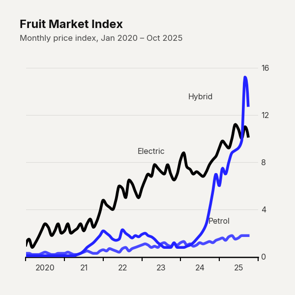
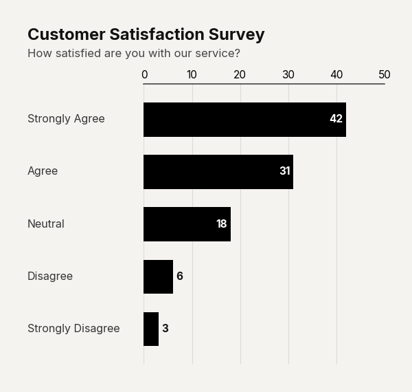
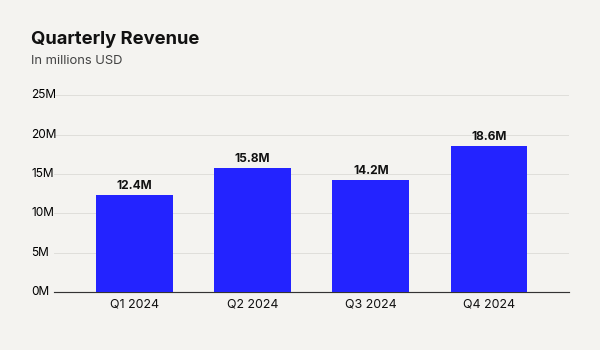
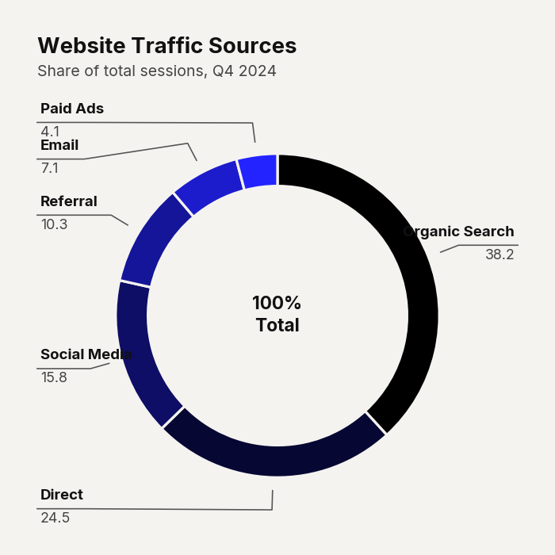
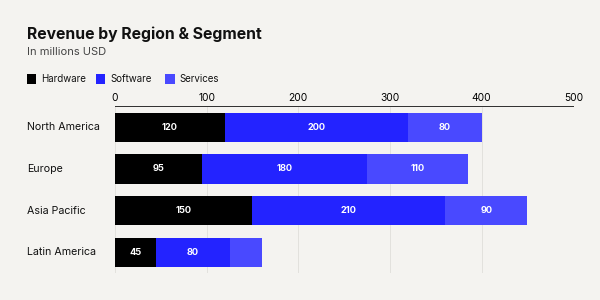
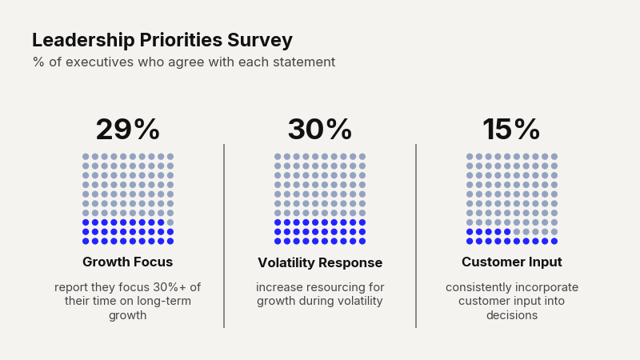
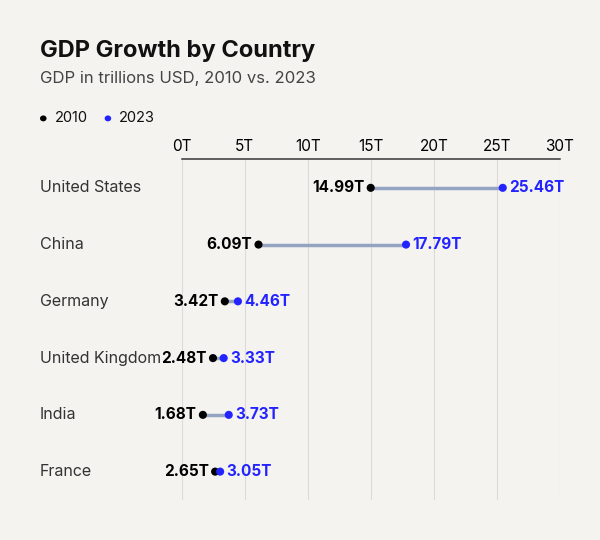
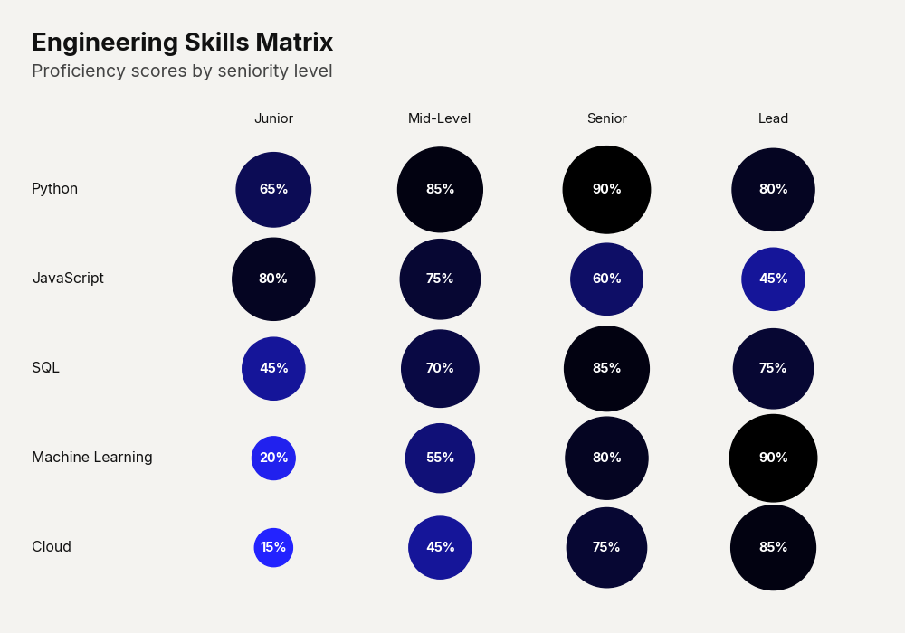
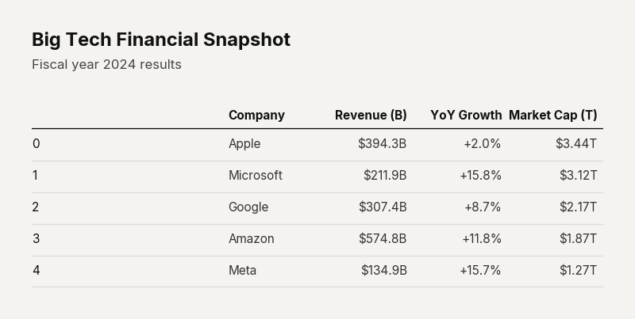
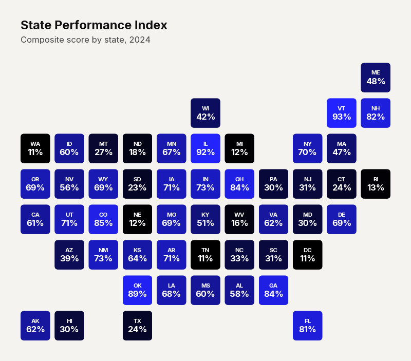

# clean-charts API Reference

> **Version:** 0.11.3 · **License:** MIT · **Python:** ≥ 3.8

`clean-charts` is a Python library for generating premium, publication-quality charts inspired by the clean aesthetics of **McKinsey**, **BCG**, and **The Economist**. Built on top of Matplotlib, it provides high-level functions that produce polished, presentation-ready visualizations with a single function call — no manual styling required.

---

## Installation

```bash
pip install clean-charts
```

**Dependencies** (installed automatically):

| Package     | Minimum Version |
|-------------|-----------------|
| matplotlib  | ≥ 3.5.0         |
| pandas      | ≥ 1.3.0         |
| numpy       | ≥ 1.20.0        |
| Pillow      | ≥ 8.0.0         |
| scipy       | ≥ 1.7.0         |
| geopandas   | ≥ 0.10.0        |

---

## Quick Start

```python
import clean_charts as cc

# Plot with built-in sample data
cc.plot_time_series(title="Market Trends", subtitle="Monthly index")

# Plot with your own data
import pandas as pd
df = pd.DataFrame({"Category": ["A", "B", "C"], "Value": [42, 31, 18]})
cc.plot_barh_chart(data=df, title="My Chart")

# Save to file
cc.plot_barh_chart(data=df, title="My Chart", output_path="chart.png")
```

---

## Architecture Overview

```
clean_charts/
├── __init__.py          # Public API re-exports
├── config.py            # Design tokens (colors, fonts, sizes)
├── data.py              # Default sample data & DataFrame conversion
├── _helpers.py          # Shared utilities (display, save, gradients)
├── fonts/               # Bundled Inter font files
└── plots/
    ├── __init__.py      # Plot function re-exports
    ├── time_series.py   # plot_time_series()
    ├── barh.py          # plot_barh_chart()
    ├── barv.py          # plot_barv_chart()
    ├── grouped_barh.py  # plot_grouped_barh_chart()
    ├── donut.py         # plot_donut_chart()
    ├── stacked_bar.py   # plot_stacked_bar_chart()
    ├── waffle.py        # plot_waffle_chart()
    ├── dumbbell.py      # plot_dumbbell_chart()
    ├── insight_card.py  # plot_insight_card()
    ├── bubble_matrix.py # plot_bubble_matrix_chart()
    ├── table.py         # plot_table()
    ├── geofacet.py      # plot_geofacet()
    └── dashboard.py     # plot_dashboard()
```

---

## Design System

All charts share a unified design language defined in `clean_charts.config`:

### Color Tokens

| Token                      | Hex       | Purpose                              |
|----------------------------|-----------|--------------------------------------|
| `BACKGROUND_COLOR`         | `#f4f3f0` | Canvas background (warm cream-gray)  |
| `GRID_COLOR`               | `#dcdbd7` | Horizontal/vertical gridlines        |
| `AXIS_COLOR`               | `#000000` | Axis lines and tick marks            |
| `TITLE_COLOR`              | `#111111` | Primary title text                   |
| `SUBTITLE_COLOR`           | `#444444` | Subtitle and secondary text          |
| `LABEL_COLOR`              | `#333333` | Tick labels, annotation text         |
| `DEFAULT_COLOR`            | `#000000` | Default bar/line color               |
| `DEFAULT_COLOR_POP`        | `#2323FF` | Accent highlight color (blue)        |
| `DEFAULT_COLOR_MUTED`      | `#94A3C0` | Muted/inactive elements              |
| `DEFAULT_START_COLOR`      | `#000000` | Gradient start (first series)        |
| `DEFAULT_END_COLOR`        | `#2323FF` | Gradient end (last series)           |
| `DEFAULT_CONNECTOR_COLOR`  | `#94A3C0` | Dumbbell connector lines             |
| `INVERTED_TEXT_COLOR`      | `#FFFFFF` | White text on dark backgrounds       |
| `LINE_SEPARATOR_COLOR`     | `#898989` | Group separator lines                |

### Typography

| Token              | Default Value                                          |
|--------------------|--------------------------------------------------------|
| `FONT_FAMILY`      | `"Inter"`                                              |
| `FONT_SANS_SERIF`  | `['Inter', 'Segoe UI', 'Arial', 'Helvetica', 'DejaVu Sans']` |
| `TITLE_FONT_SIZE`  | `17.0`                                                 |
| `SUBTITLE_FONT_SIZE` | `12.0`                                               |
| `LABEL_FONT_SIZE`  | `11.5`                                                 |
| `TICK_FONT_SIZE`   | `11.0`                                                 |
| `LEGEND_FONT_SIZE` | `10.5`                                                 |

### Data Compatibility

All plot functions accept:
- **pandas DataFrame** (native)
- **PySpark DataFrame** (auto-converted with `.toPandas()`, warnings for >20 rows, limit at 100)
- **Polars DataFrame** (auto-converted with `.to_pandas()`)
- **Any iterable** (fallback via `pd.DataFrame(data)`)

---

## Common Parameters

Most chart functions share these parameters. They are documented once here and referenced in each chart section.

| Parameter       | Type           | Default       | Description |
|-----------------|----------------|---------------|-------------|
| `data`          | `pd.DataFrame` | Built-in sample | Input data. Column structure varies by chart type. |
| `output_path`   | `str \| None`  | `None`        | File path to save PNG/JPEG. `None` displays inline (Jupyter) or via `plt.show()`. |
| `width`         | `int \| None`  | Varies        | Image width in pixels. |
| `height`        | `int \| None`  | Varies        | Image height in pixels. Auto-calculated when `None`. |
| `aspect_ratio`  | `str \| None`  | `None`        | `"square"`/`"1:1"`, `"landscape"`/`"2:1"`, `"vertical"`/`"1:2"`. Overrides explicit width/height. |
| `title`         | `str \| None`  | `None`        | Bold title text. Auto-wrapped to max 2 lines. |
| `subtitle`      | `str \| None`  | `None`        | Lighter subtitle below the title. Auto-wrapped to max 3 lines. |
| `bg_color`      | `str \| None`  | `"#f4f3f0"`   | Background hex color. |
| `value_suffix`  | `str`          | `""`          | String appended to value labels (e.g., `"%"`, `"M"`, `"x"`). |
| `scale_text`    | `bool`         | Varies        | Scale fonts and line weights proportionally with image size. |

---

## Chart Functions

| Function | Use Case | Reference |
|----------|----------|-----------|
| [`plot_time_series()`](reference/time_series.md) | Multi-series line charts with smooth spline curves, annotations, callouts, and shaded ranges | [→ Full docs](reference/time_series.md) |
| [`plot_barh_chart()`](reference/bar_charts.md) | Horizontal bar chart for rankings and categorical comparisons | [→ Full docs](reference/bar_charts.md#plot_barh_chart) |
| [`plot_barv_chart()`](reference/bar_charts.md#plot_barv_chart) | Vertical bar chart — upright counterpart to barh | [→ Full docs](reference/bar_charts.md#plot_barv_chart) |
| [`plot_grouped_barh_chart()`](reference/grouped_barh.md) | Multi-series horizontal bars with legends, group comments, and separators | [→ Full docs](reference/grouped_barh.md) |
| [`plot_donut_chart()`](reference/donut.md) | Part-of-whole donut ring with center label and color gradient | [→ Full docs](reference/donut.md) |
| [`plot_stacked_bar_chart()`](reference/stacked_bar.md) | Stacked horizontal bars with absolute or percentage mode | [→ Full docs](reference/stacked_bar.md) |
| [`plot_waffle_chart()`](reference/waffle.md) | 10×10 waffle grids for survey-style "X out of 100" data | [→ Full docs](reference/waffle.md) |
| [`plot_dumbbell_chart()`](reference/dumbbell.md) | Connected dot chart for before/after comparisons | [→ Full docs](reference/dumbbell.md) |
| [`plot_insight_card()`](reference/insight_card.md) | Bold text card for key insights and hero statistics | [→ Full docs](reference/insight_card.md) |
| [`plot_bubble_matrix_chart()`](reference/bubble_matrix.md) | Size+color encoded bubble grid for cross-tabulations | [→ Full docs](reference/bubble_matrix.md) |
| [`plot_table()`](reference/table.md) | Styled data table with conditional highlighting, MultiIndex, and formatting | [→ Full docs](reference/table.md) |
| [`plot_geofacet()`](reference/geofacet.md) | Geographic small-multiples grid (US states, UK regions) | [→ Full docs](reference/geofacet.md) |
| [`plot_dashboard()`](reference/dashboard.md) | Composite mosaic combining multiple chart types | [→ Full docs](reference/dashboard.md) |

---

## Utility Functions

### `get_default_data()`

Returns the built-in sample dataset used for time series demonstrations.

```python
import clean_charts as cc

df = cc.get_default_data()
print(df.head())
```

Returns a `pd.DataFrame` with a `"date"` column and multiple fruit price index columns (`"Apples"`, `"Oranges"`, `"Bananas"`, `"Grapes"`) spanning January 2020 to October 2025.

---

## Gallery

Below is a sample image from each chart type:

### Time Series


### Horizontal Bar


### Vertical Bar


### Grouped Horizontal Bar


### Donut


### Stacked Bar


### Waffle


### Dumbbell


### Insight Card


### Bubble Matrix


### Table


### Geofacet


### Dashboard


