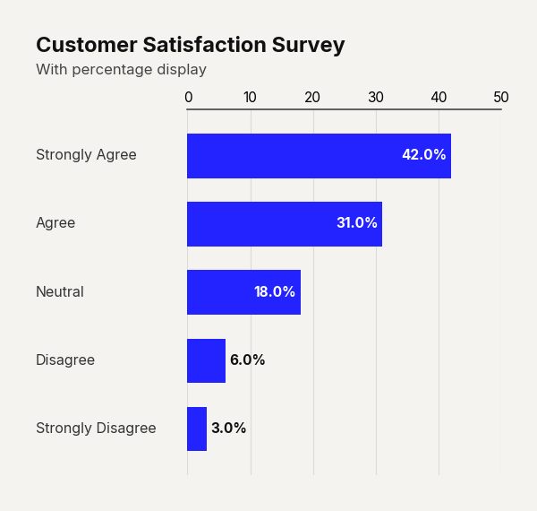
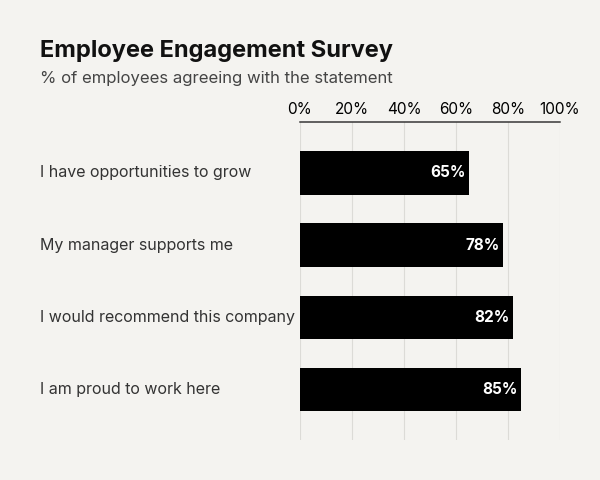
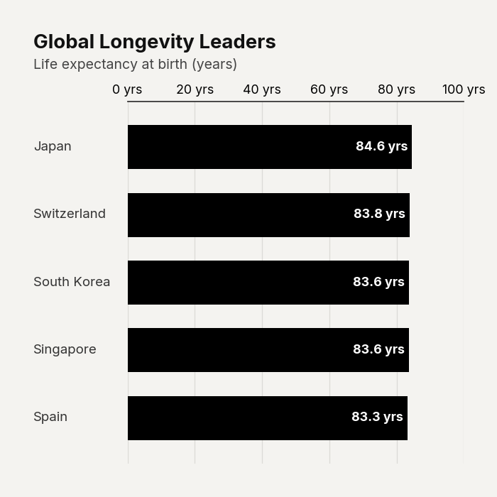

# `plot_barh_chart()`

Renders a horizontal bar chart with a single accent color, category labels left-aligned next to each bar, and numeric value labels printed inside (or outside) each bar. Designed for ranking, survey results, and categorical comparisons.


---

## Signature

```python
clean_charts.plot_barh_chart(
    data=None,
    output_path=None,
    width=None,
    height=None,
    aspect_ratio=None,
    title=None,
    subtitle=None,
    bg_color=None,
    color="#000000",
    bar_padding=0.35,
    value_suffix="",
    scale_text=True,
    show_percentages=False,
)
```

---

## Parameters

| Parameter          | Type             | Default     | Description |
|--------------------|------------------|-------------|-------------|
| `data`             | `pd.DataFrame`   | Built-in    | DataFrame with exactly **two columns**: Column 0 (str) = category labels, Column 1 (numeric) = values. Rows are displayed top-to-bottom in DataFrame order. |
| `output_path`      | `str \| None`    | `None`      | File path for the saved image. `None` displays inline. |
| `width`            | `int \| None`    | `600`       | Image width in pixels. |
| `height`           | `int \| None`    | Auto        | Image height in pixels. Auto-sized based on row count: `max(300, 120 + n × 90)`. |
| `aspect_ratio`     | `str \| None`    | `None`      | `"square"`, `"landscape"`, `"vertical"`, `"1:1"`, `"2:1"`, `"1:2"`. |
| `title`            | `str \| None`    | `None`      | Bold title text (max 2 lines). |
| `subtitle`         | `str \| None`    | `None`      | Lighter subtitle (max 3 lines). |
| `bg_color`         | `str \| None`    | `"#f4f3f0"` | Background color. |
| `color`            | `str`            | `"#000000"` | Hex color for all bars. |
| `bar_padding`      | `float`          | `0.35`      | Fraction of the bar slot left as gap between bars (0–1). Higher values create thinner bars. |
| `value_suffix`     | `str`            | `""`        | String appended to value labels and axis ticks. |
| `scale_text`       | `bool`           | `True`      | Scale fonts proportionally with image size. |
| `show_percentages` | `bool`           | `False`     | Show percentage labels (e.g., `"25.0%"`) instead of raw values. |

---

## Examples

### Basic Horizontal Bar Chart

```python
import pandas as pd
import clean_charts as cc

df = pd.DataFrame({
    "Response": ["Strongly Agree", "Agree", "Neutral", "Disagree", "Strongly Disagree"],
    "Count": [42, 31, 18, 6, 3],
})

cc.plot_barh_chart(
    data=df,
    title="Customer Satisfaction Survey",
    subtitle="How satisfied are you with our service?",
)
```


### With Percentage Display

```python
cc.plot_barh_chart(
    data=df,
    title="Customer Satisfaction Survey",
    subtitle="With percentage display",
    color="#2323FF",
    show_percentages=True,
)
```



### Use Case: Employee Satisfaction Survey (Custom Padding)

Demonstrates how to increase `bar_padding` to make bars thinner and add a `%` suffix.

```python
import pandas as pd
import clean_charts as cc

df_survey = pd.DataFrame({
    'Question': ['I am proud to work here', 'I would recommend this company', 'My manager supports me', 'I have opportunities to grow'],
    'Score': [85, 82, 78, 65]
}).sort_values('Score', ascending=True)

cc.plot_barh_chart(
    data=df_survey,
    title="Employee Engagement Survey",
    subtitle="% of employees agreeing with the statement",
    value_suffix="%",
    bar_padding=0.4,
)
```



### Use Case: Compact Mode (1:1 Aspect Ratio)

Demonstrates how to explicitly force a square 1:1 aspect ratio.

```python
df_health = pd.DataFrame({
    'Country': ['Japan', 'Switzerland', 'South Korea', 'Singapore', 'Spain'],
    'Life Expectancy': [84.6, 83.8, 83.6, 83.6, 83.3]
})

cc.plot_barh_chart(
    data=df_health,
    title="Global Longevity Leaders",
    subtitle="Life expectancy at birth (years)",
    value_suffix=" yrs",
    aspect_ratio="1:1",
)
```



---

## Visual Behavior

- **Value labels** are rendered **inside** the bar (white text, right-aligned) when the bar width exceeds 15% of the maximum value; otherwise they appear **outside** the bar (dark text, left-aligned).
- **Numeric axis** ticks are displayed along the **top** of the chart.
- **Category labels** are left-aligned flush with the title/subtitle text.
- A thin accent **spine** is drawn along the top edge of the chart area.

---

# `plot_barv_chart()`

Renders a vertical bar chart — the upright counterpart to `plot_barh_chart()`. Category labels are displayed below each bar, and value labels appear above the top of each bar.


---

## Signature

```python
clean_charts.plot_barv_chart(
    data=None,
    output_path=None,
    width=None,
    height=None,
    aspect_ratio=None,
    title=None,
    subtitle=None,
    bg_color=None,
    color="#000000",
    bar_padding=0.35,
    value_suffix="",
    scale_text=True,
    show_percentages=False,
)
```

---

## Parameters

| Parameter          | Type             | Default     | Description |
|--------------------|------------------|-------------|-------------|
| `data`             | `pd.DataFrame`   | Built-in    | DataFrame with exactly **two columns**: Column 0 (str) = category labels, Column 1 (numeric) = values. Rows are displayed left-to-right. |
| `output_path`      | `str \| None`    | `None`      | File path for the saved image. |
| `width`            | `int \| None`    | `600`       | Image width in pixels. |
| `height`           | `int \| None`    | Auto        | Auto-sized: `max(300, 150 + n × 50)`. |
| `aspect_ratio`     | `str \| None`    | `None`      | See common parameters. |
| `title`            | `str \| None`    | `None`      | Bold title text. |
| `subtitle`         | `str \| None`    | `None`      | Lighter subtitle. |
| `bg_color`         | `str \| None`    | `"#f4f3f0"` | Background color. |
| `color`            | `str`            | `"#000000"` | Hex color for all bars. |
| `bar_padding`      | `float`          | `0.35`      | Gap fraction between bars (0–1). |
| `value_suffix`     | `str`            | `""`        | String appended to value labels. |
| `scale_text`       | `bool`           | `True`      | Scale fonts proportionally. |
| `show_percentages` | `bool`           | `False`     | Show percentage labels instead of raw values. |

---

## Example

```python
import pandas as pd
import clean_charts as cc

df = pd.DataFrame({
    "Quarter": ["Q1 2024", "Q2 2024", "Q3 2024", "Q4 2024"],
    "Revenue": [12.4, 15.8, 14.2, 18.6],
})

cc.plot_barv_chart(
    data=df,
    title="Quarterly Revenue",
    subtitle="In millions USD",
    color="#2323FF",
    value_suffix="M",
)
```


---

## Visual Behavior

- **Value labels** appear **above** each bar in bold dark text.
- **Category labels** are **wrapped** and centered below each bar.
- **Y-axis ticks** are on the **left** side, with labels flush-left aligned with the title.
- **Horizontal gridlines** provide visual reference.
- The **bottom spine** acts as a thin accent baseline.
