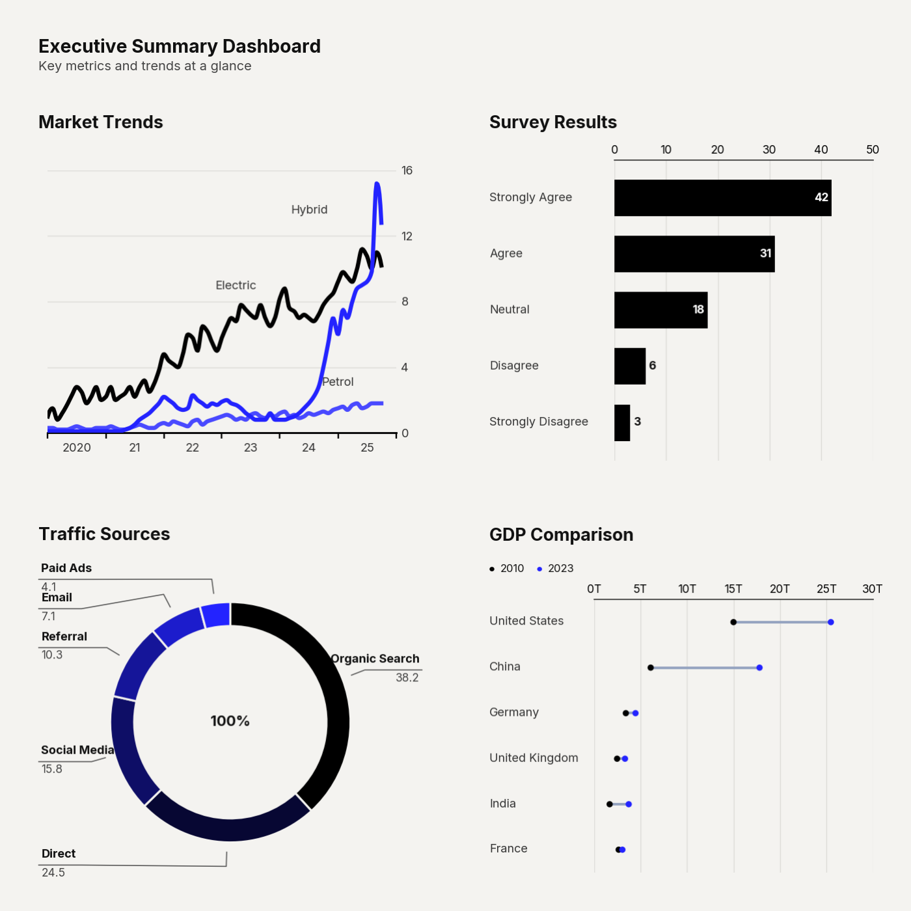

# `plot_dashboard()`

Combines multiple clean-chart visualizations into a single composite mosaic image. Each sub-chart is rendered independently at its allocated pixel resolution and composited onto a shared canvas using `matplotlib.subplot_mosaic`.

This function enables the creation of executive-style dashboards from any combination of chart types with a single function call.



---

## Signature

```python
clean_charts.plot_dashboard(
    charts,
    layout=None,
    title=None,
    subtitle=None,
    bg_color=None,
    output_path=None,
    width=1400,
    height=None,
    padding=0.02,
)
```

---

## Parameters

| Parameter     | Type                       | Default     | Description |
|---------------|----------------------------|-------------|-------------|
| `charts`      | `list[tuple]`              | **required** | List of `(plot_function, kwargs_dict)` tuples. Each tuple specifies a chart function and its keyword arguments. `output_path` is managed internally and should **not** be included in kwargs. `width` and `height` can optionally be overridden in kwargs. |
| `layout`      | `str \| None`              | Auto        | ASCII mosaic string defining the spatial arrangement. See **Layout Syntax** below. |
| `title`       | `str \| None`              | `None`      | Dashboard-level title text. |
| `subtitle`    | `str \| None`              | `None`      | Dashboard-level subtitle. |
| `bg_color`    | `str \| None`              | `"#f4f3f0"` | Canvas background color. |
| `output_path` | `str \| None`              | `None`      | File path for the saved image. |
| `width`       | `int`                      | `1400`      | Final image width in pixels. |
| `height`      | `int \| None`              | Auto        | Final image height in pixels. Auto-derived from layout aspect ratio when `None`. |
| `padding`     | `float`                    | `0.02`      | Fractional space between sub-charts (0–0.5). |

---

## Layout Syntax

The `layout` parameter uses an ASCII string where:
- Each **unique letter** maps to one chart (in order of first appearance, left-to-right, top-to-bottom).
- **Rows** are separated by `\n`.
- A letter **repeated horizontally** makes a chart span multiple columns.
- A letter **repeated vertically** makes a chart span multiple rows.
- A **period** (`.`) denotes an empty cell.

### Layout Examples

| Layout String     | Description |
|-------------------|-------------|
| `"AB\nCD"`        | 2×2 grid, 4 equal charts |
| `"AA\nBC"`        | Chart A spans full top row; B and C split the bottom |
| `"ABC"`           | Single row, 3 equal-width charts |
| `"AB\nAC"`        | Chart A spans left column; B and C stack on the right |
| `"AAB\nCCC"`      | A takes 2/3 of top, B takes 1/3; C spans full bottom |
| `"AB.\nCDE"`      | A and B in top row (C empty); C, D, E in bottom row |

When `layout=None`, an auto-generated roughly-square grid is created:
- 2 charts → `"AB"`
- 3 charts → `"AB\nC."`
- 4 charts → `"AB\nCD"`
- 5 charts → `"ABC\nDE."`
- 6 charts → `"ABC\nDEF"`

---

## Example

```python
import pandas as pd
import clean_charts as cc

# Prepare data for sub-charts
df_ts = cc.get_default_data()
df_barh = pd.DataFrame({
    "Response": ["Strongly Agree", "Agree", "Neutral", "Disagree", "Strongly Disagree"],
    "Count": [42, 31, 18, 6, 3],
})
df_donut = pd.DataFrame({
    "Source": ["Organic", "Direct", "Social", "Referral", "Email", "Paid"],
    "Share": [38.2, 24.5, 15.8, 10.3, 7.1, 4.1],
})
df_dumbbell = pd.DataFrame({
    "Country": ["US", "China", "Germany", "UK", "India", "France"],
    "2010": [14.99, 6.09, 3.42, 2.48, 1.68, 2.65],
    "2023": [25.46, 17.79, 4.46, 3.33, 3.73, 3.05],
})

cc.plot_dashboard(
    charts=[
        (cc.plot_time_series,    {"data": df_ts,       "title": "Market Trends"}),
        (cc.plot_barh_chart,     {"data": df_barh,     "title": "Survey Results"}),
        (cc.plot_donut_chart,    {"data": df_donut,    "title": "Traffic Sources", "center_label": "100%"}),
        (cc.plot_dumbbell_chart, {"data": df_dumbbell, "title": "GDP Comparison", "value_suffix": "T"}),
    ],
    layout="AB\nCD",
    title="Executive Summary Dashboard",
    subtitle="Key metrics and trends at a glance",
    output_path="dashboard.png",
)
```


---

## Visual Behavior

- Each sub-chart is rendered with **consistent scaling** — titles, subtitles, labels, and margins use a uniform scale factor derived from the 1×1 cell size. This prevents visual inconsistency between different-sized panels.
- The **dashboard title** is left-aligned to match the left margin of the first sub-chart's internal title.
- Sub-chart dimensions are calculated from the layout geometry:
  - `chart_width = span_cols × cell_w + (span_cols - 1) × padding × cell_w`
  - `chart_height = span_rows × cell_h + (span_rows - 1) × padding × cell_h`
- When `height=None`, the dashboard height is derived from the layout aspect ratio: `height = width × grid_rows / grid_cols`.
- **Title and subtitle text** is dynamically wrapped based on available width.

---

## Notes

- **Any chart function** from the `clean_charts` library can be used in a dashboard panel — including `plot_insight_card`, `plot_table`, `plot_geofacet`, and even nested `plot_dashboard` calls (though nesting is not recommended).
- The `output_path` key should **not** be included in individual chart kwargs — it is managed by the dashboard function internally.
- For best visual quality, use `width=1400` or higher for dashboards with 4+ panels.
- Sub-chart `width` and `height` can be explicitly set in kwargs to override the auto-calculated dimensions, but this is rarely needed.
- The function uses an internal buffer protocol (`_RETURN_BUFFER`) to capture each sub-chart as a PNG in memory before compositing.
