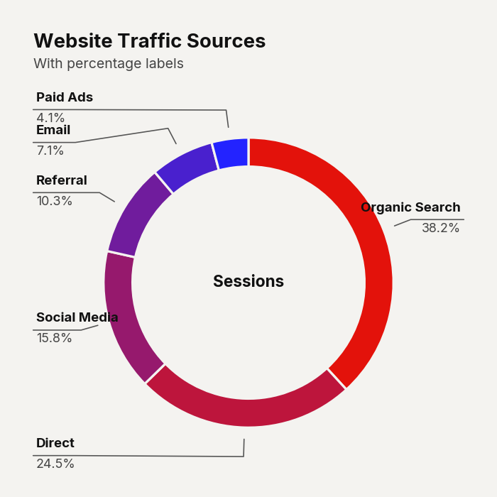
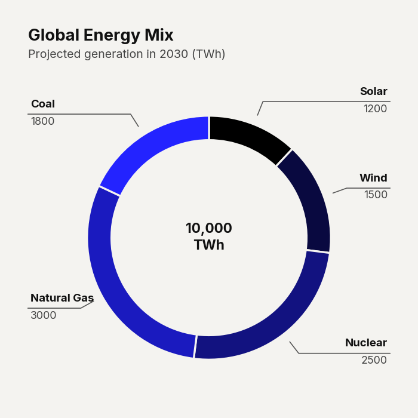
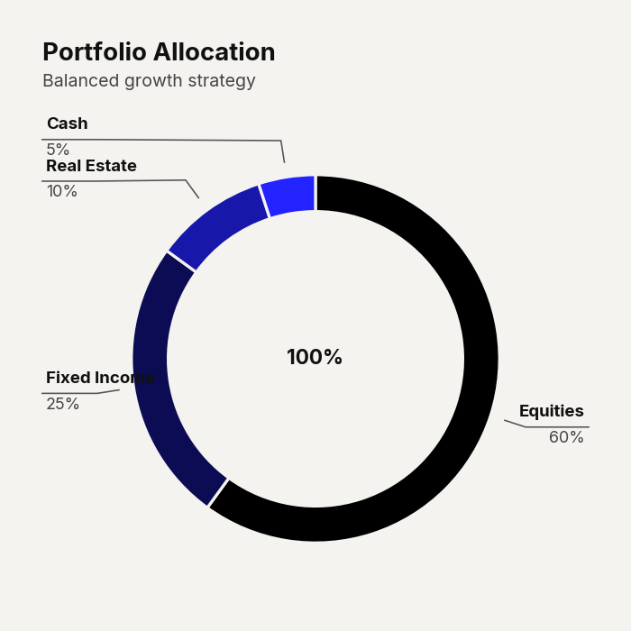

# `plot_donut_chart()`

Renders a donut (ring) chart with a hollow center for displaying summary text. Designed for part-of-whole compositions with up to ~8 segments. Each segment is rendered with a continuous color gradient from `start_color` to `end_color`.


---

## Signature

```python
clean_charts.plot_donut_chart(
    data=None,
    output_path=None,
    width=None,
    height=None,
    aspect_ratio=None,
    title=None,
    subtitle=None,
    bg_color=None,
    start_color=None,
    end_color=None,
    center_label=None,
    show_percentages=False,
    value_suffix="",
    scale_text=True,
)
```

---

## Parameters

| Parameter          | Type             | Default     | Description |
|--------------------|------------------|-------------|-------------|
| `data`             | `pd.DataFrame`   | Built-in    | DataFrame with two columns: Column 0 (str) = segment labels, Column 1 (numeric) = values. Values are automatically normalized to percentages for display. |
| `output_path`      | `str \| None`    | `None`      | File path for the saved image. |
| `width`            | `int \| None`    | `600`       | Image width in pixels. |
| `height`           | `int \| None`    | Auto        | Auto-calculated based on width and segment count. |
| `aspect_ratio`     | `str \| None`    | `None`      | `"square"`, `"landscape"`, `"vertical"`, `"1:1"`, `"2:1"`, `"1:2"`. |
| `title`            | `str \| None`    | `None`      | Bold title (max 2 lines). |
| `subtitle`         | `str \| None`    | `None`      | Lighter subtitle (max 3 lines). |
| `bg_color`         | `str \| None`    | `"#f4f3f0"` | Background color. |
| `start_color`      | `str \| None`    | `"#000000"` | Gradient start color for the first (largest) segment. |
| `end_color`        | `str \| None`    | `"#2323FF"` | Gradient end color for the last (smallest) segment. |
| `center_label`     | `str \| None`    | `None`      | Text rendered inside the center of the donut ring. Supports `\n` for multiline. E.g., `"100%\nTotal"`, `"$42M"`. |
| `show_percentages` | `bool`           | `False`     | Append `" (XX.X%)"` to each legend label. |
| `value_suffix`     | `str`            | `""`        | String appended to numeric values in the legend. |
| `scale_text`       | `bool`           | `True`      | Scale fonts proportionally. |

---

## Examples

### Basic Donut Chart

```python
import pandas as pd
import clean_charts as cc

df = pd.DataFrame({
    "Source": ["Organic Search", "Direct", "Social Media",
               "Referral", "Email", "Paid Ads"],
    "Share": [38.2, 24.5, 15.8, 10.3, 7.1, 4.1],
})

cc.plot_donut_chart(
    data=df,
    title="Website Traffic Sources",
    subtitle="Share of total sessions, Q4 2024",
    center_label="100%\nTotal",
)
```


### With Percentage Labels & Custom Colors

```python
cc.plot_donut_chart(
    data=df,
    title="Website Traffic Sources",
    subtitle="With percentage labels",
    center_label="Sessions",
    show_percentages=True,
    start_color="#e3120b",
    end_color="#2323FF",
)
```



### Use Case: Energy Mix

Demonstrates using custom text for the center label with `\n` line breaks.

```python
import pandas as pd
import clean_charts as cc

df_energy = pd.DataFrame({
    'Source': ['Solar', 'Wind', 'Nuclear', 'Natural Gas', 'Coal'],
    'TWh': [1200, 1500, 2500, 3000, 1800]
})

cc.plot_donut_chart(
    data=df_energy,
    title="Global Energy Mix",
    subtitle="Projected generation in 2030 (TWh)",
    center_label="10,000\nTWh",
)
```



### Use Case: Portfolio Allocation

Demonstrates using a percentage suffix for the legend items.

```python
df_portfolio = pd.DataFrame({
    'Asset': ['Equities', 'Fixed Income', 'Real Estate', 'Cash'],
    'Alloc': [60, 25, 10, 5]
})

cc.plot_donut_chart(
    data=df_portfolio,
    title="Portfolio Allocation",
    subtitle="Balanced growth strategy",
    center_label="100%",
    value_suffix="%",
)
```



---

## Visual Behavior

- Data is **sorted by value descending** before rendering — the largest segment starts at the top (12 o'clock position).
- **Segments with value ≤ 0** are silently excluded.
- Segments are drawn clockwise starting from 90° (top of the ring).
- The **legend** is rendered as a structured list below the donut ring, with colored squares, category labels, and values.
- When `show_percentages=True`, each legend entry shows `"Label (XX.X%)"`.
- The **center label** is rendered in a medium-bold font at the exact center of the ring. Use `\n` for multi-line center labels (e.g., a number on top, a caption below).
- The donut width (ring thickness) is automatically calibrated relative to the overall size.
