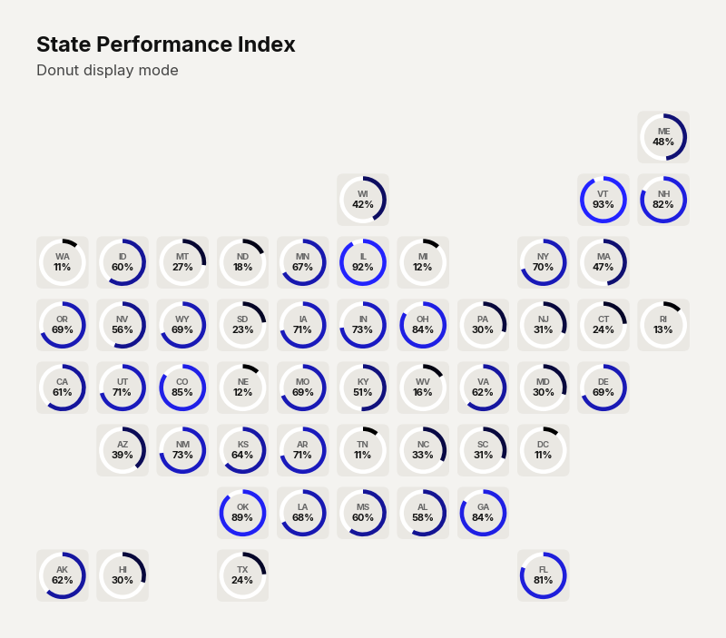
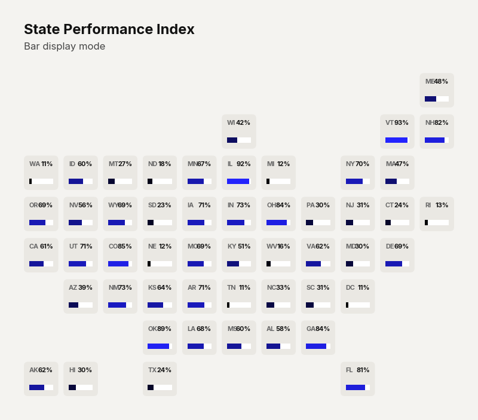

# `plot_geofacet()`

Renders a geographic small-multiples chart where each cell in a grid approximates the physical position of a state or region on a map. Each cell can display data as a **heatmap tile** (text mode), a **donut ring**, or a **progress bar**.

Currently supports **US states** and **UK regions** layouts.


---

## Signature

```python
clean_charts.plot_geofacet(
    data,
    state_col=None,
    value_col=None,
    layout="us",
    display_type="text",
    max_value=100.0,
    color=None,
    bg_color=None,
    start_color=None,
    end_color=None,
    missing_color="#e0e0e0",
    title=None,
    subtitle=None,
    output_path=None,
    width=None,
    height=None,
    aspect_ratio=None,
    value_suffix="",
    scale_text=True,
)
```

---

## Parameters

### Data & Layout

| Parameter    | Type             | Default     | Description |
|--------------|------------------|-------------|-------------|
| `data`       | `pd.DataFrame`   | **required** | DataFrame with location abbreviations and numeric values. |
| `state_col`  | `str \| None`    | Auto        | Column name containing location abbreviations (e.g., `"CA"`, `"NY"` for US; `"LON"`, `"SCT"` for UK). Auto-detected as the first column. |
| `value_col`  | `str \| None`    | Auto        | Column name containing numeric values. Auto-detected as the second column. |
| `layout`     | `str`            | `"us"`      | Grid layout to use. Options: `"us"` / `"usa"`, `"uk"` / `"united kingdom"`. |

### Display

| Parameter       | Type          | Default     | Description |
|-----------------|---------------|-------------|-------------|
| `display_type`  | `str`         | `"text"`    | Cell rendering style. Options: `"text"` (heatmap tiles with colored backgrounds), `"donut"` (progress ring around the cell), `"bar"` (horizontal progress bar inside the cell). `"pie"` is aliased to `"donut"`. |
| `max_value`     | `float`       | `100.0`     | Maximum value for scaling donut/bar progress. Values are clipped to `[0, max_value]` for donut and bar modes. |
| `value_suffix`  | `str`         | `""`        | String appended to value labels (e.g., `"%"`). |

### Colors

| Parameter       | Type          | Default     | Description |
|-----------------|---------------|-------------|-------------|
| `color`         | `str \| None` | `"#000000"` | Base color for chart elements. |
| `bg_color`      | `str \| None` | `"#f4f3f0"` | Canvas background color. |
| `start_color`   | `str \| None` | `"#000000"` | Gradient start for heatmap interpolation (lowest value). |
| `end_color`     | `str \| None` | `"#2323FF"` | Gradient end for heatmap interpolation (highest value). |
| `missing_color` | `str`         | `"#e0e0e0"` | Color for states with no data (gray). |

### Layout & Text

| Parameter      | Type          | Default     | Description |
|----------------|---------------|-------------|-------------|
| `title`        | `str \| None` | `None`      | Bold title text. |
| `subtitle`     | `str \| None` | `None`      | Lighter subtitle text. |
| `output_path`  | `str \| None` | `None`      | File path for the saved image. |
| `width`        | `int \| None` | `800`       | Image width in pixels. |
| `height`       | `int \| None` | Auto        | Auto-calculated to produce square cells based on the grid dimensions. |
| `aspect_ratio` | `str \| None` | `None`      | `"landscape"`, `"vertical"`. |
| `scale_text`   | `bool`        | `True`      | Scale fonts proportionally. |

---

## Supported Layouts

### United States (`layout="us"`)

An 8×11 grid approximating the US map with all 50 states + DC. State abbreviations use standard USPS codes (e.g., `"CA"`, `"NY"`, `"TX"`).

### United Kingdom (`layout="uk"`)

A 5×5 grid covering UK regions:
`SCT`, `NIR`, `NE`, `NW`, `YOR`, `WAL`, `WM`, `EM`, `EE`, `SW`, `SE`, `LON`

---

## Examples

### Text Mode (Heatmap)

```python
import pandas as pd
import numpy as np
import clean_charts as cc

states = ["CA", "TX", "FL", "NY", "PA", "IL", "OH", "GA", "NC", "MI",
          "NJ", "VA", "WA", "AZ", "MA", "TN", "IN", "MO", "MD", "WI"]
np.random.seed(42)
df = pd.DataFrame({"State": states, "Score": np.random.randint(10, 95, len(states))})

cc.plot_geofacet(
    data=df,
    title="State Performance Index",
    subtitle="Composite score by state, 2024",
    display_type="text",
    value_suffix="%",
)
```


### Donut Mode

```python
cc.plot_geofacet(
    data=df,
    title="State Performance Index",
    subtitle="Donut display mode",
    display_type="donut",
    value_suffix="%",
)
```



### Bar Mode

```python
cc.plot_geofacet(
    data=df,
    title="State Performance Index",
    subtitle="Bar display mode",
    display_type="bar",
    value_suffix="%",
)
```



---

## Visual Behavior

### Text Mode (`display_type="text"`)
- Each state cell is a **rounded rectangle** colored by the value using linear interpolation between `start_color` and `end_color`.
- **Text color** automatically adjusts for contrast: white text on dark backgrounds, dark text on light backgrounds (based on luminance).
- The **state abbreviation** appears in the upper half; the **value** appears below it in larger, bolder text.

### Donut Mode (`display_type="donut"`)
- Cells have a neutral cream background (`#EAE8E3`).
- A thin **circular track** (white) shows the full 100% range.
- A colored **arc** fills clockwise from the top, proportional to `value / max_value`.
- State abbreviation and value are centered inside the ring.

### Bar Mode (`display_type="bar"`)
- Cells have a neutral cream background.
- State abbreviation (left) and value (right) are displayed at the top of the cell.
- A horizontal **progress bar** fills from left to right, proportional to `value / max_value`.

### Missing Data
- States without data display only the abbreviation in `missing_color` with a transparent background.

---

## Notes

- **Height is auto-calculated** to produce perfectly square cells when `height` is not explicitly set.
- The chart automatically handles states not present in the data — they appear as ghost cells.
- For the US layout, Hawaii and Alaska are positioned in the bottom-left corner of the grid.
