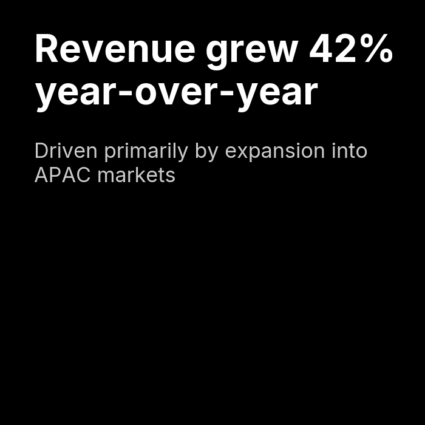

# `plot_insight_card()`

Renders a bold, solid-color card with large stylized text — designed for "key insight" callouts, hero stats, or executive-summary statements. Supports optional subtext and an optional raster image positioned at the bottom of the card.


---

## Signature

```python
clean_charts.plot_insight_card(
    text,
    subtext=None,
    image_path=None,
    output_path=None,
    width=None,
    height=None,
    aspect_ratio=None,
    bg_color=config.DEFAULT_COLOR_POP,
    text_color=config.INVERTED_TEXT_COLOR,
    scale_text=True,
)
```

---

## Parameters

| Parameter      | Type          | Default       | Description |
|----------------|---------------|---------------|-------------|
| `text`         | `str`         | **required**  | The main insight text to display. Automatically wrapped and font-sized based on length: `< 50 chars` = 64pt base, `< 100` = 48pt, `< 200` = 36pt, `≥ 200` = 28pt. |
| `subtext`      | `str \| None` | `None`        | Secondary text below the main text, rendered smaller (55% of main font size) and with 80% opacity. Auto-wrapped. |
| `image_path`   | `str \| None` | `None`        | Path to a PNG/JPG image to render at the bottom of the card. Right-aligned and sized to fit within the available space. SVG is not supported. |
| `output_path`  | `str \| None` | `None`        | File path for the saved image. |
| `width`        | `int \| None` | `800`         | Image width in pixels. |
| `height`       | `int \| None` | `450`         | Image height in pixels. |
| `aspect_ratio` | `str \| None` | `None`        | Controls overall proportions. Options: `"landscape"` / `"2:1"` (800×450), `"square"` / `"1:1"` (700×700), `"vertical"` / `"1:2"` (500×1000), `"portrait"` / `"3:4"` (600×800), `"card"` / `"4:5"` (800×1000). |
| `bg_color`     | `str`         | `"#2323FF"`   | Card background color. Defaults to the library accent color (`DEFAULT_COLOR_POP`). |
| `text_color`   | `str`         | `"#FFFFFF"`   | Text color. Defaults to white (`INVERTED_TEXT_COLOR`). |
| `scale_text`   | `bool`        | `True`        | Scale font sizes proportionally with card dimensions. |

---

## Examples

### Basic Insight Card

```python
import clean_charts as cc

cc.plot_insight_card(
    text="73% of Fortune 500 companies have adopted AI-driven analytics in 2024",
    subtext="Source: McKinsey Global Institute Annual Report",
)
```


### Dark Theme — Square Aspect Ratio

```python
cc.plot_insight_card(
    text="Revenue grew 42% year-over-year",
    subtext="Driven primarily by expansion into APAC markets",
    bg_color="#000000",
    text_color="#FFFFFF",
    aspect_ratio="square",
)
```



---

## Aspect Ratio Presets

| Name           | String Values     | Default Size (w×h) |
|----------------|-------------------|---------------------|
| Landscape      | `"landscape"`, `"2:1"` | 800 × 450      |
| Square         | `"square"`, `"1:1"`    | 700 × 700      |
| Vertical       | `"vertical"`, `"1:2"`  | 500 × 1000     |
| Portrait       | `"portrait"`, `"3:4"`  | 600 × 800      |
| Card           | `"card"`, `"4:5"`      | 800 × 1000     |

When `aspect_ratio` is set along with `width` or `height`, the missing dimension is calculated automatically. If both `width` and `height` are provided, `height` is recalculated from `width` and the aspect ratio.

---

## Visual Behavior

- The text is rendered **top-left** of the card with generous padding (80px × scale).
- Font size is **auto-calibrated** based on text length and iteratively shrunk if it would overlap the image region (the bottom 40% of the card).
- Text is automatically **word-wrapped** to fit within the card width.
- The **subtext** appears directly below the main text with a 55% font scale and 80% opacity for visual hierarchy.
- When an **image** is provided, it is positioned in the **bottom-right** of the card, occupying up to 40% of the card height while preserving its aspect ratio.

---

## Notes

- Unlike other chart functions, `plot_insight_card()` does **not** accept a `data` parameter — it takes a direct `text` string.
- This is a text-heavy visualization. For best results, keep the main text under 150 characters.
- The `bg_color` and `text_color` work together — ensure sufficient contrast (e.g., dark background + white text, or light background + dark text).
