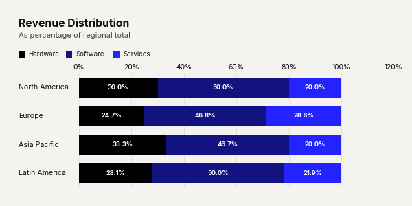
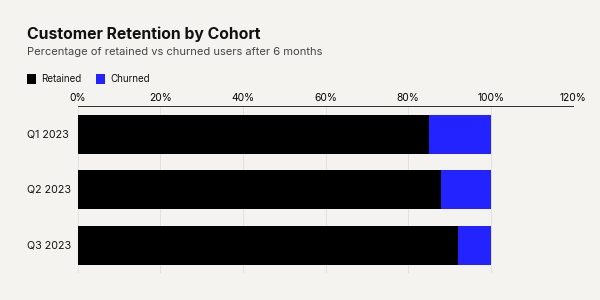

# `plot_stacked_bar_chart()`

Renders a stacked horizontal bar chart where each row represents a category and segments within the bar represent sub-categories. A continuous color gradient is applied across segments. Supports both absolute values and percentage-of-total modes.


---

## Signature

```python
clean_charts.plot_stacked_bar_chart(
    data=None,
    output_path=None,
    width=None,
    height=None,
    aspect_ratio=None,
    title=None,
    subtitle=None,
    bg_color=None,
    start_color=None,
    end_color=None,
    bar_labels="none",
    show_percentages=False,
    value_suffix="",
    scale_text=True,
)
```

---

## Parameters

| Parameter          | Type             | Default     | Description |
|--------------------|------------------|-------------|-------------|
| `data`             | `pd.DataFrame`   | Built-in    | DataFrame where Column 0 (str) = category labels and all subsequent columns (numeric) = segment values. Each column becomes a segment in the stacked bar. |
| `output_path`      | `str \| None`    | `None`      | File path for the saved image. |
| `width`            | `int \| None`    | `600`       | Image width in pixels. |
| `height`           | `int \| None`    | Auto        | Auto-sized based on row count: `max(300, 120 + n × 90)`. |
| `aspect_ratio`     | `str \| None`    | `None`      | `"square"`, `"landscape"`, `"vertical"`. |
| `title`            | `str \| None`    | `None`      | Bold title (max 2 lines). |
| `subtitle`         | `str \| None`    | `None`      | Lighter subtitle (max 3 lines). |
| `bg_color`         | `str \| None`    | `"#f4f3f0"` | Background color. |
| `start_color`      | `str \| None`    | `"#000000"` | Gradient start color (first segment in the stack). |
| `end_color`        | `str \| None`    | `"#2323FF"` | Gradient end color (last segment in the stack). |
| `bar_labels`       | `str`            | `"none"`    | Labels inside each segment. Options: `"none"`, `"value"` (numeric), `"name"` (column name), `"both"` (name + value). |
| `show_percentages` | `bool`           | `False`     | Normalize each row to 100% and display percentages. When `True`, all bars have equal total length. |
| `value_suffix`     | `str`            | `""`        | String appended to value labels and axis ticks. |
| `scale_text`       | `bool`           | `True`      | Scale fonts proportionally. |

---

## Examples

### Basic Stacked Bar Chart

```python
import pandas as pd
import clean_charts as cc

df = pd.DataFrame({
    "Region": ["North America", "Europe", "Asia Pacific", "Latin America"],
    "Hardware": [120, 95, 150, 45],
    "Software": [200, 180, 210, 80],
    "Services": [80, 110, 90, 35],
})

cc.plot_stacked_bar_chart(
    data=df,
    title="Revenue by Region & Segment",
    subtitle="In millions USD",
    bar_labels="value",
)
```


### Percentage Mode

```python
cc.plot_stacked_bar_chart(
    data=df,
    title="Revenue Distribution",
    subtitle="As percentage of regional total",
    show_percentages=True,
    bar_labels="value",
    start_color="#000000",
    end_color="#2323FF",
)
```



### Use Case: Customer Retention by Cohort

Demonstrates applying a suffix across all values.

```python
df_churn = pd.DataFrame({
    'Cohort': ['Q1 2023', 'Q2 2023', 'Q3 2023'],
    'Retained': [85, 88, 92],
    'Churned': [15, 12, 8]
})

cc.plot_stacked_bar_chart(
    data=df_churn,
    title="Customer Retention by Cohort",
    subtitle="Percentage of retained vs churned users after 6 months",
    value_suffix="%",
)
```



---

## Visual Behavior

- A **color legend row** is automatically rendered between the subtitle and bars, showing colored squares and segment names.
- The **gradient** is computed from `start_color` to `end_color` across all segment columns (not across rows).
- **Segment labels** (when enabled) are drawn inside each segment:
  - White text for segments that are wide enough.
  - Narrow segments skip labels to avoid visual clutter.
- When `show_percentages=True`:
  - All bars are normalized to sum to 100%.
  - Value labels display `"XX%"` instead of raw values.
  - The X-axis range is fixed to 0–100.
- **Category labels** are left-aligned flush with the title/subtitle.
- X-axis **tick labels** appear along the top of the chart.
