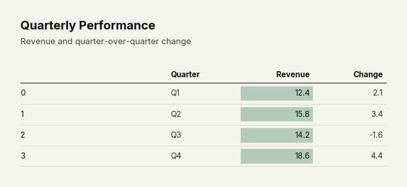

# `plot_table()`

Renders a styled data table as an image using Matplotlib primitives. Supports column alignment and formatting, multi-level column/row grouping via `pandas.MultiIndex`, conditional cell highlighting with rules, color-scale heatmaps, alternating row stripes, and automatic text wrapping.

This is a powerful function for creating publication-quality data tables that can be embedded in presentations, reports, and dashboards.


---

## Signature

```python
clean_charts.plot_table(
    data=None,
    output_path=None,
    width=None,
    height=None,
    aspect_ratio=None,
    title=None,
    subtitle=None,
    bg_color=None,
    columns=None,
    cellStyles=None,
    highlightRules=None,
    options=None,
    scale_text=False,
)
```

---

## Parameters

### Data & Output

| Parameter     | Type                           | Default  | Description |
|---------------|--------------------------------|----------|-------------|
| `data`        | `pd.DataFrame \| list[dict]`   | Required | The data to render. Supports flat DataFrames, `pd.MultiIndex` columns (for grouped headers), and `pd.MultiIndex` rows (for grouped row sections). |
| `output_path` | `str \| None`                  | `None`   | File path for the saved image. |

### Dimensions

| Parameter      | Type          | Default     | Description |
|----------------|---------------|-------------|-------------|
| `width`        | `int \| None` | `800`       | Image width in pixels. |
| `height`       | `int \| None` | Auto        | Auto-calculated from content height. Formula: `title_h + header_h + row_count × row_h`. |
| `aspect_ratio` | `str \| None` | `None`      | `"landscape"`, `"square"`, `"vertical"`. |
| `scale_text`   | `bool`        | `False`     | Scale fonts proportionally. |

### Appearance

| Parameter   | Type          | Default     | Description |
|-------------|---------------|-------------|-------------|
| `title`     | `str \| None` | `None`      | Bold title text. |
| `subtitle`  | `str \| None` | `None`      | Lighter subtitle. |
| `bg_color`  | `str \| None` | `"#f4f3f0"` | Background color. |

---

## Column Configuration

The `columns` parameter accepts a list of dicts, one per data column. Each dict configures that column's rendering:

| Key              | Type    | Default        | Description |
|------------------|---------|----------------|-------------|
| `align`          | `str`   | Auto-detected  | Cell text alignment: `"left"`, `"right"`, `"center"`. Auto-defaults to `"right"` for numeric columns, `"left"` for text. |
| `header_align`   | `str`   | Same as `align` | Header text alignment (can differ from cell alignment). |
| `width_pct`      | `float` | Auto           | Column width as a fraction of total width (0–1). |
| `format`         | `str`   | `"{}"`         | Python format string for numeric values (e.g., `"${:,.2f}"`, `"{:.1f}%"`). |

**Example:**
```python
columns = [
    {"align": "left"},                       # Company names
    {"align": "right", "format": "${:,.1f}B"},  # Revenue
    {"align": "right"},                      # Growth %
    {"align": "right", "format": "${:,.2f}T"},  # Market cap
]
```

---

## Cell Styles

The `cellStyles` parameter accepts a dict keyed by `(row_idx, col_idx)` tuples (0-indexed based on data columns):

| Key                | Type   | Description |
|--------------------|--------|-------------|
| `backgroundColor`  | `str`  | Cell background color (hex). |
| `textColor`        | `str`  | Cell text color (hex). |
| `bold`             | `bool` | Render text in bold. |

**Example:**
```python
cellStyles = {
    (0, 0): {"bold": True},
    (2, 1): {"backgroundColor": "#ff0000", "textColor": "#ffffff"},
}
```

---

## Highlight Rules

The `highlightRules` parameter accepts a list of rule dicts that automatically color cells based on their values:

### Rule Types

#### 1. `"positive-negative"` — Green/Red Coloring

Colors positive values green and negative values red (or custom colors).

```python
highlightRules = [{
    "col": 1,  # Optional: restrict to column index
    "condition": "positive-negative",
    "positive_color": "#b2ccb9",  # Optional, default: config green
    "negative_color": "#ffc4b2",  # Optional, default: config red
}]
```

#### 2. `"range"` — Continuous Color Scale (Heatmap)

Creates a diverging color scale from zero — intensity scales linearly with magnitude.

```python
highlightRules = [{
    "condition": "range",
    "col": 2,           # Optional
    "max_color": "#b2ccb9",  # Color for max positive value
    "min_color": "#ffc4b2",  # Color for max negative value
}]
```

#### 3. `callable` — Custom Function

A function `f(value, row_idx, col_idx)` that returns a hex color string or `None`.

```python
highlightRules = [{
    "condition": lambda v, r, c: "#ff0000" if isinstance(v, str) and "Error" in v else None,
}]
```

---

## Table Options

The `options` parameter accepts a dict controlling global table formatting:

| Key                      | Type    | Default     | Description |
|--------------------------|---------|-------------|-------------|
| `showPills`              | `bool`  | `True`      | Draw colored pill rectangles behind highlighted cells. |
| `rowGroupDivider`        | `bool`  | `True`      | Draw horizontal lines between row groups (MultiIndex). |
| `rowGroupSpacing`        | `float` | `1.0`       | Vertical spacing multiplier between row groups. |
| `columnGroupDivider`     | `bool`  | `False`     | Draw vertical lines between column groups (MultiIndex). |
| `columnGroupSpacing`     | `float` | `0.03`      | Horizontal spacing between column groups. |
| `alternateRowHighlight`  | `bool`  | `False`     | Apply alternating row background colors. |
| `alternateRowBgColor`    | `str`   | `"#eeedea"` | Background color for alternating rows. |
| `rowSpacing`             | `float` | `1.0`       | Global row height multiplier. |
| `columnSpacing`          | `float` | `1.0`       | Global column horizontal padding multiplier. |
| `rowLabelWidthPct`       | `float` | Auto        | Width fraction reserved for the row label column. |

---

## Examples

### Basic Data Table

```python
import pandas as pd
import clean_charts as cc

df = pd.DataFrame({
    "Company": ["Apple", "Microsoft", "Google", "Amazon", "Meta"],
    "Revenue (B)": [394.3, 211.9, 307.4, 574.8, 134.9],
    "YoY Growth": ["+2.0%", "+15.8%", "+8.7%", "+11.8%", "+15.7%"],
    "Market Cap (T)": [3.44, 3.12, 2.17, 1.87, 1.27],
})

cc.plot_table(
    data=df,
    title="Big Tech Financial Snapshot",
    subtitle="Fiscal year 2024 results",
    columns=[
        {"align": "left"},
        {"align": "right", "format": "${:,.1f}B"},
        {"align": "right"},
        {"align": "right", "format": "${:,.2f}T"},
    ],
)
```


### Conditional Highlighting

```python
df = pd.DataFrame({
    "Quarter": ["Q1", "Q2", "Q3", "Q4"],
    "Revenue": [12.4, 15.8, 14.2, 18.6],
    "Change": [2.1, 3.4, -1.6, 4.4],
})

cc.plot_table(
    data=df,
    title="Quarterly Performance",
    subtitle="Revenue and quarter-over-quarter change",
    highlightRules=[{
        "col": 1,
        "condition": "positive-negative",
        "positive_color": "#b2ccb9",
        "negative_color": "#ffc4b2",
    }],
)
```



---

## MultiIndex Support

### Grouped Columns

```python
import pandas as pd

columns = pd.MultiIndex.from_tuples([
    ("Revenue", "Q1"), ("Revenue", "Q2"),
    ("Costs", "Q1"), ("Costs", "Q2"),
])

df = pd.DataFrame(
    [[100, 120, 80, 85], [200, 210, 150, 160]],
    columns=columns,
    index=["Product A", "Product B"],
)

cc.plot_table(data=df, title="Financial Summary")
```

This renders a two-level header: group headers (`"Revenue"`, `"Costs"`) spanning their sub-columns (`"Q1"`, `"Q2"`).

### Grouped Rows

```python
index = pd.MultiIndex.from_tuples([
    ("North", "New York"), ("North", "Boston"),
    ("South", "Miami"), ("South", "Houston"),
])

df = pd.DataFrame(
    {"Sales": [100, 85, 120, 95], "Growth": ["+5%", "+3%", "+12%", "+8%"]},
    index=index,
)

cc.plot_table(data=df, title="Regional Sales")
```

This renders row groups with bold group headers and indented row labels.

---

## Visual Behavior

- **Column header alignment** follows `header_align` (falls back to `align`).
- **Numeric formatting** via the `format` key uses Python's `str.format()` — e.g., `"${:,.2f}"` for `$1,234.56`.
- **Row labels** (DataFrame index) are rendered in the first column with double the weight of data columns.
- **Text wrapping** is fully automatic. Long text in cells, headers, and row labels wraps to fit within the column width.
- **Row heights** are dynamically calculated based on wrapped text — rows with more lines are taller.
- Thin **horizontal dividers** separate every row; a bolder top divider separates headers from data.
- When `showPills=True` (default), highlighted cells get a solid-color rectangle behind the text.
