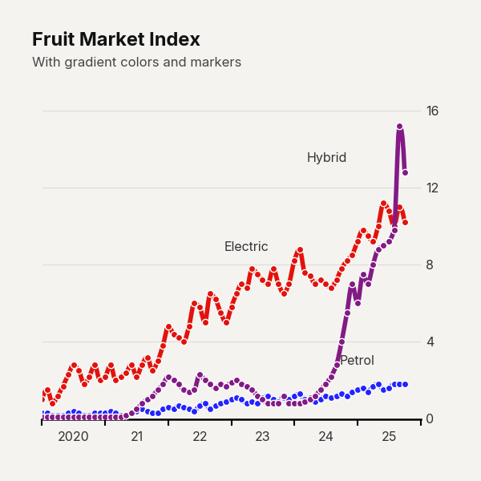
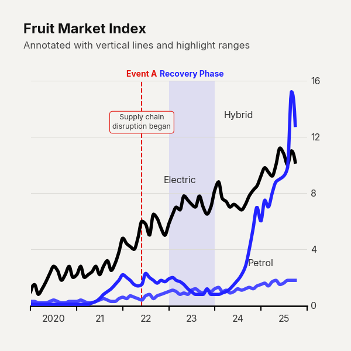
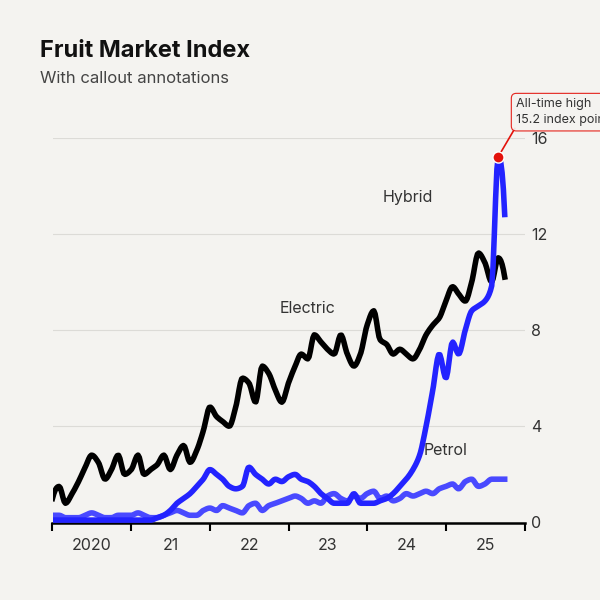
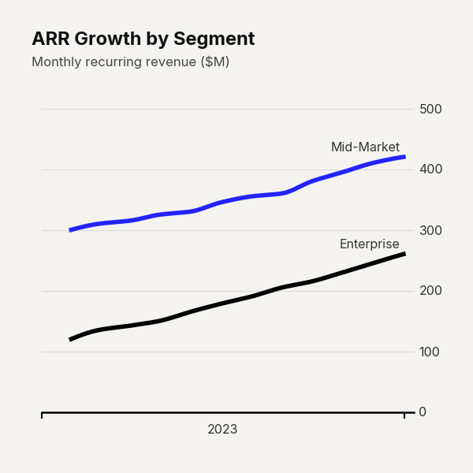
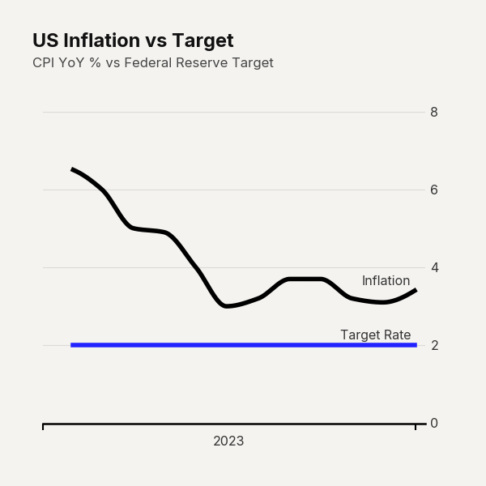

# `plot_time_series()`

Renders a multi-series time-series line chart with smooth spline interpolation, inline series labels, and support for advanced annotations including vertical reference lines, shaded time ranges, and data-point callouts.

This is the most feature-rich chart type in the library, designed for visualizing trends over time with publication-quality polish.


---

## Signature

```python
clean_charts.plot_time_series(
    data=None,
    output_path=None,
    width=None,
    height=None,
    aspect_ratio=None,
    title=None,
    subtitle=None,
    bg_color=None,
    start_color=None,
    end_color=None,
    label_frequency="year",
    markers=None,
    line_labels="name",
    value_suffix="",
    smooth=True,
    scale_text=False,
    vlines=None,
    highlight_ranges=None,
    callouts=None,
)
```

---

## Parameters

### Data & Output

| Parameter     | Type             | Default         | Description |
|---------------|------------------|-----------------|-------------|
| `data`        | `pd.DataFrame`   | Built-in sample | DataFrame with a date/time column and one or more numeric value columns. The date column is auto-detected by name (`"date"`, `"time"`, `"timestamp"`) or dtype. All other columns are treated as series. |
| `output_path` | `str \| None`    | `None`          | File path to save the image. `None` displays inline. |

### Dimensions

| Parameter      | Type          | Default | Description |
|----------------|---------------|---------|-------------|
| `width`        | `int \| None` | `600`   | Image width in pixels. |
| `height`       | `int \| None` | `600`   | Image height in pixels. |
| `aspect_ratio` | `str \| None` | `None`  | `"square"` / `"1:1"` (700×700), `"landscape"` / `"2:1"` (900×450), `"vertical"` / `"1:2"` (500×1000). |

### Appearance

| Parameter        | Type          | Default             | Description |
|------------------|---------------|---------------------|-------------|
| `title`          | `str \| None` | `None`              | Bold title text. Auto-wrapped to max 2 lines. |
| `subtitle`       | `str \| None` | `None`              | Lighter subtitle below the title. Auto-wrapped to max 3 lines. |
| `bg_color`       | `str \| None` | `"#f4f3f0"`         | Background hex color. |
| `start_color`    | `str \| None` | `"#000000"`         | Hex color for the first line series. When paired with `end_color`, generates a gradient across all series. |
| `end_color`      | `str \| None` | `"#2323FF"`         | Hex color for the last line series. |
| `scale_text`     | `bool`        | `False`             | Scale fonts and line weights proportionally with image size. |

### Line Rendering

| Parameter         | Type              | Default  | Description |
|-------------------|-------------------|----------|-------------|
| `smooth`          | `bool`            | `True`   | Draw smooth PCHIP spline curves through data points instead of straight line segments. Requires `scipy`. |
| `markers`         | `bool \| str`     | `None`   | Data-point markers. `False`/`None` = no markers. `True` = circle markers (`"o"`). Any valid matplotlib marker string (e.g., `"s"`, `"D"`, `"^"`). |
| `line_labels`     | `str`             | `"name"` | Inline text labels drawn near line endpoints. Options: `"name"` (series name only), `"value"` (last numeric value), `"both"` (name + value), `"none"` (no labels). |
| `value_suffix`    | `str`             | `""`     | String appended to value labels (e.g., `"%"`, `"x"`). |
| `label_frequency` | `str`             | `"year"` | X-axis label frequency. Options: `"year"`, `"quarter"`, `"month"`, `"week"`, `"day"`, `"hour"`, `"minute"`, `"second"`. |

### Annotations

#### `vlines` — Vertical Reference Lines

Draws vertical dashed lines on specific dates with optional labels and paragraph annotations.

| Type | Accepted Forms |
|------|---------------|
| Single date string | `"2023-06-15"` |
| Dict with options | `{"date": "2023-06-15", "color": "#e3120b", "label": "Launch", "paragraph": "Product v2.0 launched"}` |
| List of mixed | `["2023-01-01", {"date": "2024-06-01", "label": "Event"}]` |

**Dict keys:**

| Key            | Type    | Default       | Description |
|----------------|---------|---------------|-------------|
| `date`         | `str`   | **required**  | Date string or datetime. |
| `color`        | `str`   | `"#000000"`   | Line and label color. |
| `linewidth`    | `float` | `1.5×scale`   | Line thickness. |
| `linestyle`    | `str`   | `"--"`        | Matplotlib line style. |
| `label`        | `str`   | `None`        | Bold heading text above the chart area. |
| `paragraph`    | `str`   | `None`        | Multi-line annotation in a rounded box. Use `\n` for line breaks. |
| `paragraph_y`  | `float` | `0.85`        | Vertical placement (0–1, axis fraction). |

#### `highlight_ranges` — Shaded Time Ranges

Draws semi-transparent shaded rectangles over time ranges with optional labels and paragraph annotations.

| Type | Accepted Forms |
|------|---------------|
| Tuple of two dates | `("2022-01-01", "2023-01-01")` |
| Dict with options | `{"start": "2022-01-01", "end": "2023-01-01", "color": "#1f77b4", "alpha": 0.15, "label": "Recession"}` |
| List of mixed | `[("2022-01", "2022-06"), {"start": "2023-01", "end": "2024-01"}]` |

**Dict keys:**

| Key            | Type    | Default       | Description |
|----------------|---------|---------------|-------------|
| `start`        | `str`   | **required**  | Range start date. |
| `end`          | `str`   | **required**  | Range end date. |
| `color`        | `str`   | `"#1f77b4"`   | Fill color. |
| `alpha`        | `float` | `0.12`        | Fill opacity. |
| `label`        | `str`   | `None`        | Bold heading above the range. |
| `paragraph`    | `str`   | `None`        | Multi-line annotation inside the range. |
| `paragraph_y`  | `float` | `0.85`        | Vertical placement (0–1, axis fraction). |

#### `callouts` — Data Point Annotations

Annotates specific data points with a dot, leader line, and text box. The value is automatically looked up from the data by snapping to the nearest date.

Accepts a single dict or a list of dicts.

**Dict keys:**

| Key       | Type    | Default                    | Description |
|-----------|---------|----------------------------|-------------|
| `date`    | `str`   | **required**               | Target date. Snaps to nearest available data point. |
| `series`  | `str`   | First value column         | Column name to read the y-value from. |
| `text`    | `str`   | **required**               | Annotation text. Use `\n` for multiple lines. |
| `color`   | `str`   | Series color               | Dot and border color. |
| `text_x`  | `float` | Auto (small rightward nudge) | Horizontal offset in axis-data units. |
| `text_y`  | `float` | Auto (small upward nudge)    | Vertical offset in data units. |
| `ha`      | `str`   | `"left"`                   | Horizontal alignment: `"left"`, `"center"`, `"right"`. |

---

## Examples

### Basic Time Series

```python
import clean_charts as cc

cc.plot_time_series(
    title="Fruit Market Index",
    subtitle="Monthly price index, Jan 2020 – Oct 2025",
)
```


### Custom Colors & Markers

```python
cc.plot_time_series(
    title="Fruit Market Index",
    subtitle="With gradient colors and markers",
    start_color="#e3120b",
    end_color="#2323FF",
    markers=True,
)
```



### Vertical Lines & Highlight Ranges

```python
cc.plot_time_series(
    title="Fruit Market Index",
    subtitle="Annotated with vertical lines and highlight ranges",
    vlines=[{
        "date": "2022-06-01",
        "color": "#e3120b",
        "label": "Event A",
        "paragraph": "Supply chain\ndisruption began",
    }],
    highlight_ranges=[{
        "start": "2023-01-01",
        "end": "2024-01-01",
        "color": "#2323FF",
        "alpha": 0.10,
        "label": "Recovery Phase",
    }],
)
```



### Callout Annotations

```python
cc.plot_time_series(
    title="Fruit Market Index",
    subtitle="With callout annotations",
    callouts=[{
        "date": "2025-09-01",
        "series": "Bananas",
        "text": "All-time high\n15.2 index points",
        "color": "#e3120b",
    }],
)
```



### Use Case: SaaS Metrics

Demonstrates how to add a `$` prefix to the y-axis values.

```python
import pandas as pd
import clean_charts as cc

dates = pd.date_range(start='2023-01-01', periods=12, freq='ME')
df_saas = pd.DataFrame({
    'date': dates,
    'Enterprise': [120, 135, 142, 150, 165, 178, 190, 205, 215, 230, 245, 260],
    'Mid-Market': [300, 310, 315, 325, 330, 345, 355, 360, 380, 395, 410, 420]
})

cc.plot_time_series(
    data=df_saas,
    title="ARR Growth by Segment",
    subtitle="Monthly recurring revenue ($M)",
)
```



### Use Case: Macroeconomic Trends

Demonstrates using a `%` suffix for the y-axis.

```python
df_macro = pd.DataFrame({
    'date': dates,
    'Inflation': [6.5, 6.0, 5.0, 4.9, 4.0, 3.0, 3.2, 3.7, 3.7, 3.2, 3.1, 3.4],
    'Target Rate': [2.0, 2.0, 2.0, 2.0, 2.0, 2.0, 2.0, 2.0, 2.0, 2.0, 2.0, 2.0]
})

cc.plot_time_series(
    data=df_macro,
    title="US Inflation vs Target",
    subtitle="CPI YoY % vs Federal Reserve Target",
)
```



---

## Notes

- The date column is auto-detected by searching for columns with names containing `"date"`, `"time"`, or `"timestamp"`, or by checking for datetime dtypes. Falls back to the first column.
- All non-date columns are plotted as separate series.
- When `smooth=True` (default), PCHIP (Piecewise Cubic Hermite Interpolating Polynomial) interpolation is used, which preserves monotonicity and avoids oscillation artifacts that standard cubic splines can produce.
- The Y-axis is positioned on the **right side** of the chart, matching The Economist's style.
- X-axis labels are intelligently formatted — showing full year on first label, then abbreviated format for subsequent labels.
