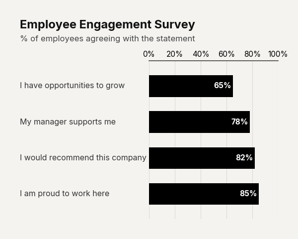
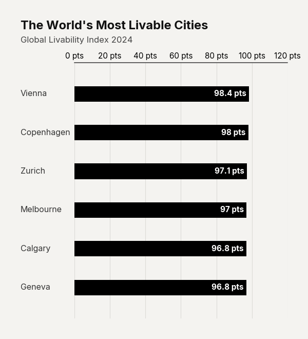

# Bar Chart Variations & Use Cases

The `plot_barh_chart` and `plot_barv_chart` functions can be adapted for highly specific data presentations by adjusting padding, aspect ratios, and value rendering.

## Use Case: Employee Satisfaction Survey

When dealing with Likert scale or survey data where the metric is a percentage, use `value_suffix="%"`. You can also increase `bar_padding` to make the bars thinner, drawing more attention to the precise values.

```python
import pandas as pd
import clean_charts as cc

df_survey = pd.DataFrame({
    'Question': [
        'I am proud to work here', 
        'I would recommend this company', 
        'My manager supports me', 
        'I have opportunities to grow'
    ],
    'Score': [85, 82, 78, 65]
}).sort_values('Score', ascending=True)

cc.plot_barh_chart(
    data=df_survey,
    title="Employee Engagement Survey",
    subtitle="% of employees agreeing with the statement",
    value_suffix="%",
    bar_padding=0.4,
)
```



## Use Case: Compact Top 5 Ranking

For ranking short lists (like a Top 5), a 1:1 square aspect ratio often fits better into reports and presentation slides.

```python
df_health = pd.DataFrame({
    'Country': ['Japan', 'Switzerland', 'South Korea', 'Singapore', 'Spain'],
    'Life Expectancy': [84.6, 83.8, 83.6, 83.6, 83.3]
})

cc.plot_barh_chart(
    data=df_health,
    title="Global Longevity Leaders",
    subtitle="Life expectancy at birth (years)",
    value_suffix=" yrs",
    aspect_ratio="1:1",
)
```



## Value Label Alignment Details

`clean_charts` automatically handles the complex logic of where to place text inside bars to ensure legibility:
- **Inside**: If a bar's width is large enough (exceeding 15% of the max value), the label is rendered in white text, right-aligned inside the bar.
- **Outside**: If the bar is too short, the label flips to the outside, rendered in dark text, left-aligned.
