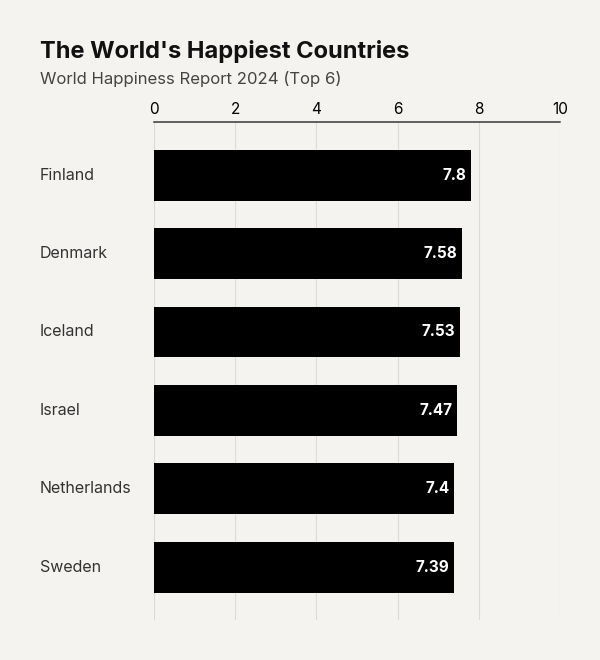

# Use Case: Minimalist Ranking

In dense reports, heavily colored or thickly padded bar charts can easily overwhelm the page with unnecessary visual weight. The 'Minimalist Ranking' variation deliberately starves the chart of ink. By employing ultra-thin padding and a stark monochrome palette, the focus shifts entirely to the textual rank order. This highly refined, understated approach is exceptionally effective when the goal is to present a clean hierarchy—such as a top 10 list—without dominating the surrounding narrative.

```python
import pandas as pd
import clean_charts as cc

df = pd.DataFrame({"Rank": ["A", "B", "C"], "Score": [99, 85, 70]})

cc.plot_barh_chart(
    data=df,
    title="Top Performers",
    subtitle="Ranked by score",
    bar_padding=0.7,
    color="#000000",
    value_suffix=" pts"
)
```


