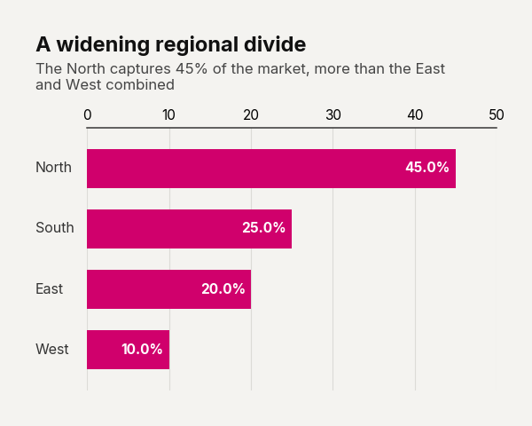

# Use Case: Progress-to-Goal Tracker

Visualizing progress toward a goal requires a design that feels weighty and absolute. By thickening the bars and shifting to a landscape aspect ratio, this configuration mimics the familiar visual language of a loading bar. When combined with percentage suffixes and a high-contrast primary color, it immediately communicates completion status. This structure is ideal for tracking quarterly KPIs or OKRs, providing an unambiguous, at-a-glance read on departmental performance.

```python
import pandas as pd
import clean_charts as cc

df = pd.DataFrame({"Department": ["Sales", "Engineering"], "Progress": [0.85, 0.40]})

cc.plot_barh_chart(
    data=df,
    title="Q3 Objectives",
    subtitle="Progress towards quarterly goals",
    show_percentages=True,
    bar_padding=0.2,
    aspect_ratio="landscape",
    color="#2323FF"
)
```


