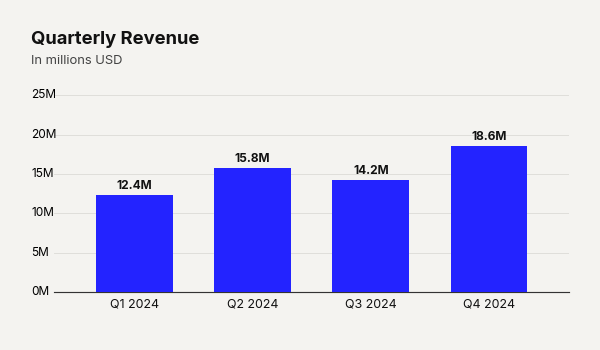

# Use Case: Timeline Histogram

Not all time-series data belongs on a line chart. When displaying distinct volumes over discrete periods (such as annual trading volume or distinct yearly sales), a continuous line can imply false continuity. By compressing the `bar_padding` to near-zero, the vertical bar chart morphs into a timeline histogram. This creates a solid, block-like distribution that accurately reflects discrete accumulation, grounding the viewer in the true weight of the metric over time.

```python
import pandas as pd
import clean_charts as cc

df = pd.DataFrame({"Year": [2018, 2019, 2020, 2021, 2022], "Volume": [10, 15, 25, 40, 60]})

cc.plot_barv_chart(
    data=df,
    title="Trading Volume",
    subtitle="Annual volume (millions)",
    bar_padding=0.05,
    color="#cccccc",
    value_suffix="M"
)
```


