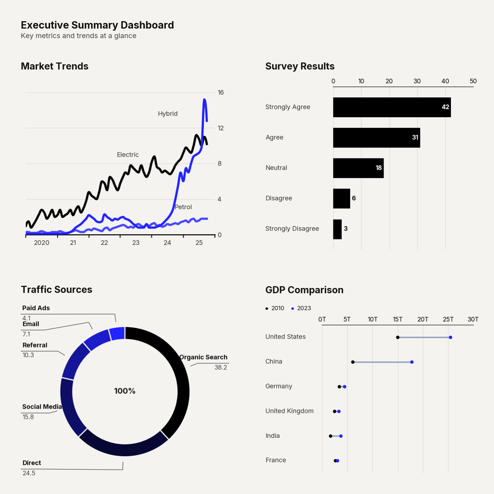

# Use Case: CEO Morning Brief

Executive attention spans are fleeting. The 'CEO Morning Brief' dashboard does not ask the reader to scroll through multiple pages of disjointed charts; it consolidates the entire narrative into a unified, high-density mosaic layout. By strategically juxtaposing leading indicators (Insight Cards) with historical context (Time Series) and granular details (Data Tables), it provides a complete, 360-degree view of business health in a single, un-scrollable pane of glass.

```python
import clean_charts as cc

cc.plot_dashboard(
    charts=[...], # Provide generated chart objects
    layout="2x2",
    title="Executive Daily Brief"
)
```


