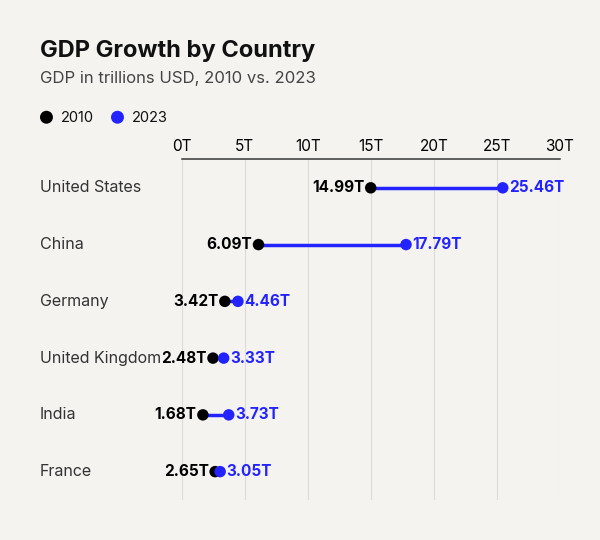
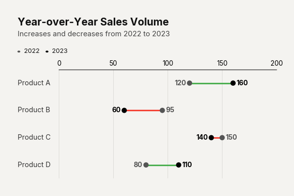
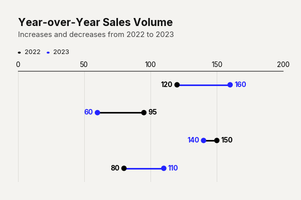

# `plot_dumbbell_chart()`

Renders a dumbbell chart (also called a Cleveland dot plot or lollipop chart) that visually encodes the difference between two values per category using connected dots. Ideal for "before vs. after", "actual vs. target", or "Period A vs. Period B" comparisons.



---

## Signature

```python
clean_charts.plot_dumbbell_chart(
    data=None,
    output_path=None,
    width=None,
    height=None,
    aspect_ratio=None,
    title=None,
    subtitle=None,
    bg_color=None,
    start_color=None,
    end_color=None,
    connector_color=None,
    positive_connector_color=None,
    negative_connector_color=None,
    value_suffix="",
    show_values=True,
    show_labels=True,
    scale_text=True,
)
```

---

## Parameters

| Parameter          | Type             | Default     | Description |
|--------------------|------------------|-------------|-------------|
| `data`             | `pd.DataFrame`   | Built-in    | DataFrame with exactly **three columns**: Column 0 (str) = category labels. Column 1 (numeric) = left dot value (e.g., "before" or "2020"). Column 2 (numeric) = right dot value (e.g., "after" or "2023"). |
| `output_path`      | `str \| None`    | `None`      | File path for the saved image. |
| `width`            | `int \| None`    | `600`       | Image width in pixels. |
| `height`           | `int \| None`    | Auto        | Auto-sized: `max(300, 120 + n × 65)`. |
| `aspect_ratio`     | `str \| None`    | `None`      | `"square"`, `"landscape"`, `"vertical"`. |
| `title`            | `str \| None`    | `None`      | Bold title text. |
| `subtitle`         | `str \| None`    | `None`      | Lighter subtitle text. |
| `bg_color`         | `str \| None`    | `"#f4f3f0"` | Background color. |
| `start_color`      | `str \| None`    | `"#000000"` | Hex color for the **first** value column (Column 1) dots. |
| `end_color`        | `str \| None`    | `"#2323FF"` | Hex color for the **second** value column (Column 2) dots. |
| `connector_color`  | `str \| None`    | `None`      | Hex color for the horizontal line. If provided, overrides dynamic colors. |
| `positive_connector_color` | `str \| None` | `end_color` | Hex color for the connecting line when the difference is positive (end >= start). |
| `negative_connector_color` | `str \| None` | `start_color` | Hex color for the connecting line when the difference is negative (end < start). |
| `value_suffix`     | `str`            | `""`        | String appended to value annotations. |
| `show_values`      | `bool`           | `True`      | Display numeric values next to each dot. |
| `show_labels`      | `bool`           | `True`      | Display category labels on the left side of the chart. |
| `scale_text`       | `bool`           | `True`      | Scale fonts proportionally. |

---

## Example

```python
import pandas as pd
import clean_charts as cc

df = pd.DataFrame({
    "Country": ["United States", "China", "Germany",
                "United Kingdom", "India", "France"],
    "2010": [14.99, 6.09, 3.42, 2.48, 1.68, 2.65],
    "2023": [25.46, 17.79, 4.46, 3.33, 3.73, 3.05],
})

cc.plot_dumbbell_chart(
    data=df,
    title="GDP Growth by Country",
    subtitle="GDP in trillions USD, 2010 vs. 2023",
    value_suffix="T",
    show_values=True,
)
```


---

## Example 2: Dynamic Connector Colors

By default, `plot_dumbbell_chart` dynamically colors the connector lines based on whether the value increased or decreased. You can customize these colors using `positive_connector_color` and `negative_connector_color`.

```python
import pandas as pd
import clean_charts as cc

df = pd.DataFrame({
    "Category": ["Product A", "Product B", "Product C", "Product D"],
    "2022": [120, 95, 150, 80],
    "2023": [160, 60, 140, 110],
})

cc.plot_dumbbell_chart(
    data=df,
    title="Year-over-Year Sales Volume",
    subtitle="Increases and decreases from 2022 to 2023",
    positive_connector_color="#4CAF50",  # Green for increase
    negative_connector_color="#F44336",  # Red for decrease
    start_color="#555555",
    end_color="#000000",
    show_values=True,
)
```



---

## Example 3: No Category Labels

You can hide the category labels on the Y-axis by setting `show_labels=False`. This is useful when the categories are self-evident or explained elsewhere.

```python
cc.plot_dumbbell_chart(
    data=df,
    title="Year-over-Year Sales Volume",
    subtitle="Increases and decreases from 2022 to 2023",
    show_labels=False,
    show_values=True,
)
```



---

## Visual Behavior

- A **color legend** is automatically drawn between the subtitle and the chart, showing the two series names with colored dot indicators.
- Each category row displays:
  - A horizontal **connector line** spanning the range. Colored dynamically: `positive_connector_color` if the value increased, or `negative_connector_color` if decreased. Overridden by `connector_color` if provided.
  - Two **dots** (circles): one in `start_color` (Column 1) and one in `end_color` (Column 2).
  - When `show_values=True`, numeric values appear as small annotations near each dot.
- The X-axis ticks appear along the **top** of the chart.
- **Category labels** are left-aligned flush with the title and subtitle (unless `show_labels=False`).
- **Gridlines** run vertically through the chart area.
- Data is displayed top-to-bottom in the order it appears in the DataFrame.

---

## Notes

- The chart expects exactly **three columns**: one label column and two value columns. Additional columns are ignored.
- The column names (e.g., `"2010"` and `"2023"`) automatically populate the legend.
- Dot sizes are proportional to `scale` for visual consistency.
