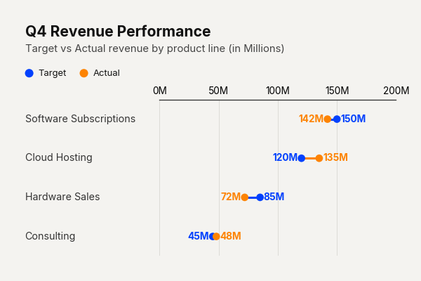

# Use Case: Sentiment Shift

Visualizing attitudinal shifts or survey results over time requires a format that emphasizes movement. The dumbbell chart excels here by plotting 'Before' and 'After' states on the same horizontal plane. By widening the padding between categories, the chart isolates each question, allowing the reader to trace the trajectory of sentiment independently. This format is vastly superior to side-by-side bars because it explicitly draws the vector of change, turning static data into a narrative of progression.

```python
import pandas as pd
import clean_charts as cc

df = pd.DataFrame({"Question": ["UX", "Speed", "Reliability"], "Before": [3.2, 2.5, 4.0], "After": [4.5, 4.2, 4.1]})

cc.plot_dumbbell_chart(
    data=df,
    title="Product Sentiment Shift",
    subtitle="Before vs After v2.0 Release (1-5 Scale)",
    0.5
)
```


