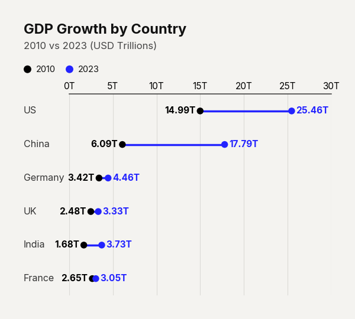

# Use Case: Target vs Actual Tracker

Comparing two distinct metrics across multiple categories using standard grouped bars often creates a cluttered, 'picket-fence' aesthetic. The 'Target vs Actual' dumbbell plot is a massive leap in clarity. By anchoring a neutral gray dot for the target and a stark black dot for the actual performance, the connecting line visually quantifies the gap. The reader's eye is naturally drawn to the longest lines, instantly highlighting the largest variances and underperformances without parsing raw numbers.

```python
import pandas as pd
import clean_charts as cc

df = pd.DataFrame({"Metric": ["A", "B", "C"], "Target": [100, 100, 100], "Actual": [85, 105, 90]})

cc.plot_dumbbell_chart(
    data=df,
    title="Performance to Target",
    subtitle="Gray = Target, Black = Actual",
    start_color="#d3d3d3",
    end_color="#000000",
    dot_size=120
)
```


