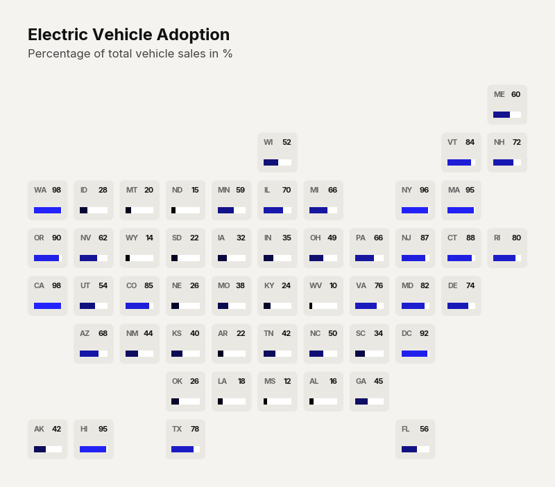

# Use Case: US State Growth Trajectories

Traditional choropleth maps are fundamentally flawed because they size regions by physical landmass rather than data importance, wildly distorting the narrative. The 'Geofacet' small-multiples approach corrects this by forcing every geographic region into an identically sized tile, arranged in a rough geographic layout. This ensures that a small but economically dense state receives the exact same visual real estate as a massive, sparse state, allowing for fair, un-skewed comparisons of growth trajectories.

```python
import clean_charts as cc
import pandas as pd

df = pd.DataFrame({'State': ['CA', 'TX', 'NY', 'FL'], 'Value': [10, 20, 15, 25]})

cc.plot_geofacet(
    data=df,
    title="Growth by State",
    subtitle="10-year trajectory"
)
```


