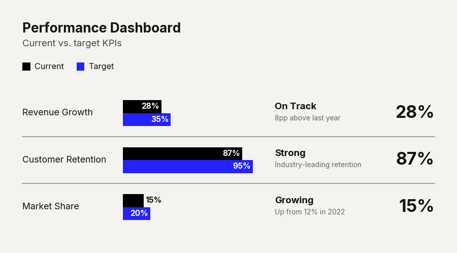

# `plot_grouped_barh_chart()`

Renders a grouped horizontal bar chart where each category row contains multiple bars — one per numeric series. Supports an inline legend, per-group structured comment annotations, and visual group separators.


---

## Signature

```python
clean_charts.plot_grouped_barh_chart(
    data=None,
    output_path=None,
    width=None,
    height=None,
    aspect_ratio=None,
    title=None,
    subtitle=None,
    bg_color=None,
    start_color="#000000",
    end_color="#2323FF",
    bar_padding=0,
    group_padding=0.45,
    value_suffix="",
    bar_labels="none",
    scale_text=True,
    group_comments=None,
    group_separators=False,
)
```

---

## Parameters

### Data & Output

| Parameter     | Type             | Default     | Description |
|---------------|------------------|-------------|-------------|
| `data`        | `pd.DataFrame`   | Built-in    | DataFrame whose **first column** contains category labels (str) and every subsequent column contains numeric values for one series. Rows are displayed top-to-bottom. |
| `output_path` | `str \| None`    | `None`      | File path for the saved image. |

### Dimensions

| Parameter      | Type          | Default | Description |
|----------------|---------------|---------|-------------|
| `width`        | `int \| None` | `600`   | Image width. Auto-widened when `group_comments` require more space. |
| `height`       | `int \| None` | Auto    | Auto-sized based on category count and series count. |
| `aspect_ratio` | `str \| None` | `None`  | `"square"`, `"landscape"`, `"vertical"`. |

### Appearance

| Parameter        | Type    | Default     | Description |
|------------------|---------|-------------|-------------|
| `title`          | `str`   | `None`      | Bold title text (max 2 lines). |
| `subtitle`       | `str`   | `None`      | Lighter subtitle (max 3 lines). |
| `bg_color`       | `str`   | `"#f4f3f0"` | Background color. |
| `start_color`    | `str`   | `"#000000"` | Hex gradient start for the first series. |
| `end_color`      | `str`   | `"#2323FF"` | Hex gradient end for the last series. |
| `bar_padding`    | `float` | `0`         | Gap fraction within a single bar slot (0–1). |
| `group_padding`  | `float` | `0.45`      | Gap fraction of the group height between groups (0–1). |
| `value_suffix`   | `str`   | `""`        | String appended to axis tick labels. |
| `scale_text`     | `bool`  | `True`      | Scale fonts proportionally. |

### Bar Labels

| Parameter    | Type  | Default  | Description |
|--------------|-------|----------|-------------|
| `bar_labels` | `str` | `"none"` | Labels drawn on each bar. Options: `"none"` (no labels), `"value"` (numeric value), `"name"` (series name), `"both"` (name + value). |

### Group Comments

| Parameter          | Type                   | Default | Description |
|--------------------|------------------------|---------|-------------|
| `group_comments`   | `list[dict] \| None`   | `None`  | Per-group structured annotations rendered to the right of the bars. List length must match the number of categories. |
| `group_separators` | `bool`                 | `False` | Draw thin horizontal lines between adjacent groups. |

Each `group_comments` dict can contain:

| Key           | Type  | Description |
|---------------|-------|-------------|
| `heading`     | `str` | Bold heading text. |
| `subtitle`    | `str` | Lighter descriptive text below heading. |
| `big_number`  | `str` | Large prominent metric (e.g., `"1.8×"`, `"87%"`). Rendered far-right. |

Any key may be omitted. Only provided fields are rendered.

---

## Examples

### Basic Grouped Bar Chart

```python
import pandas as pd
import clean_charts as cc

df = pd.DataFrame({
    "Department": ["Engineering", "Marketing", "Sales", "Support"],
    "2023": [85, 72, 90, 68],
    "2024": [92, 78, 95, 82],
})

cc.plot_grouped_barh_chart(
    data=df,
    title="Employee Satisfaction by Department",
    subtitle="Year-over-year comparison",
    bar_labels="value",
    value_suffix="%",
)
```


### With Group Comments & Separators

```python
df = pd.DataFrame({
    "Metric": ["Revenue Growth", "Customer Retention", "Market Share"],
    "Current": [28, 87, 15],
    "Target": [35, 95, 20],
})

cc.plot_grouped_barh_chart(
    data=df,
    title="Performance Dashboard",
    subtitle="Current vs. target KPIs",
    bar_labels="value",
    value_suffix="%",
    group_comments=[
        {"heading": "On Track", "subtitle": "8pp above last year", "big_number": "28%"},
        {"heading": "Strong", "subtitle": "Industry-leading retention", "big_number": "87%"},
        {"heading": "Growing", "subtitle": "Up from 12% in 2022", "big_number": "15%"},
    ],
    group_separators=True,
)
```



---

## Visual Behavior

- A **color legend** row is automatically drawn between the subtitle and the chart area, showing colored squares and series names.
- When `group_comments` are provided, the chart **auto-widens**, x-axis ticks and gridlines are **hidden**, and the right region is reserved for structured comment blocks.
- **Bar labels** positioned inside bars use white text; short bars place labels outside in dark text.
- Comment text is auto-wrapped to 32 characters per line and dynamically scaled to fit within group boundaries.
