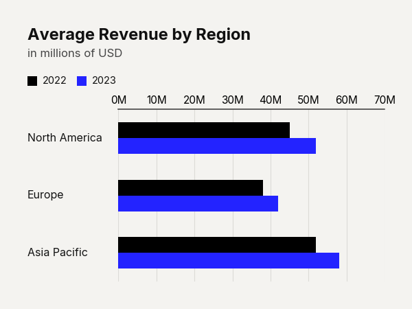

# `plot_grouped_barh_chart()`

**Overview**
Renders a grouped horizontal bar chart where each category row contains multiple bars. This chart is designed for period-over-period comparisons or comparing multiple discrete segments across several categories.



## Basic Usage

```python
import pandas as pd
import clean_charts as cc

df = pd.DataFrame({
    "Product": ["Software", "Hardware", "Services"],
    "Q1 2023": [12, 18, 5],
    "Q1 2024": [16, 17, 8],
})

cc.plot_grouped_barh_chart(
    data=df,
    title="Quarterly Revenue by Product Line",
    subtitle="In millions USD",
    value_suffix="M",
)
```

## Data Requirements

The input `data` (a `pandas.DataFrame`) must adhere to the following constraints:
* **Dimensions**: 3 or more columns.
* **Column 0**: Category labels (strings).
* **Column 1+**: Numeric values for each series. The column names will be used in the auto-generated legend.

## API Reference

```python
clean_charts.plot_grouped_barh_chart(
    data=None, output_path=None, width=None, height=None, aspect_ratio=None,
    title=None, subtitle=None, bg_color="#f4f3f0", start_color="#000000", end_color="#2323FF",
    bar_padding=0, group_padding=0.45, value_suffix="", bar_labels="none", scale_text=True,
    group_comments=None, group_separators=False
)
```

| Parameter | Type | Default | Description |
|-----------|------|---------|-------------|
| `data` | `pd.DataFrame` | Built-in | DataFrame whose first column is category labels, and subsequent columns are numeric series. |
| `start_color`, `end_color` | `str` | `"#000000"`, `"#2323FF"` | Hex colors. A gradient is automatically interpolated for all series between these two anchors. |
| `bar_labels` | `str` | `"none"` | Options: `"none"`, `"value"`, `"name"`, `"both"`. |
| `group_comments` | `list[dict] \| None` | `None` | Per-group structured annotations rendered to the right of the bars. List length must match category count. |
| `group_separators` | `bool` | `False` | Draw thin horizontal lines between adjacent groups. |

## Design Best Practices

* **Gradient Styling**: Rather than using rainbow colors for different series (e.g., years), `clean_charts` applies a perceptual gradient from `start_color` to `end_color`. Order your DataFrame columns logically (e.g., chronologically) so the gradient implies a progression.
* **Inline vs Legend**: If you have many categories, use `bar_labels="value"` inside the bars to avoid making the reader scan back and forth to an axis.
