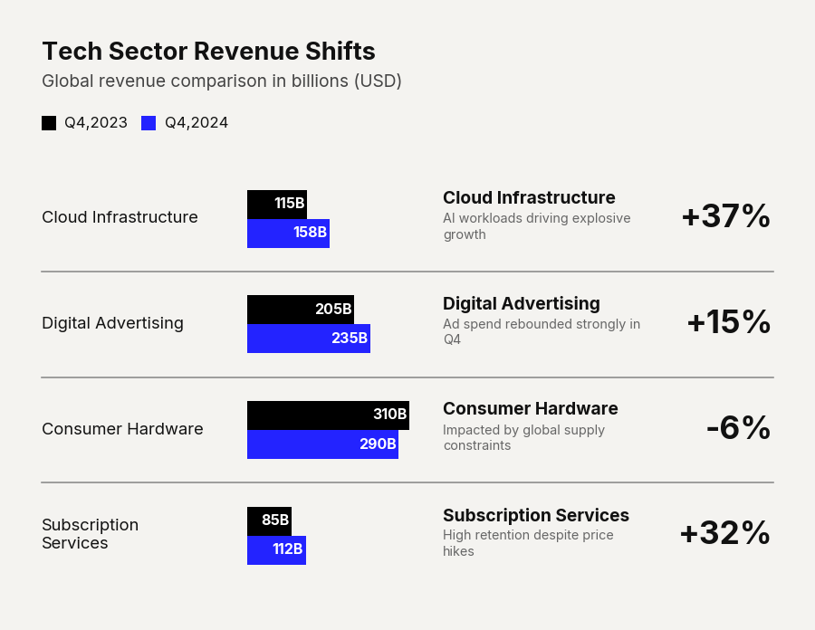

# Use Case: Strategic Scorecard

Executives do not want to hunt for the takeaway; they want the insight delivered upfront. The 'Strategic Scorecard' variation aggressively stretches the group padding and draws hard separator lines to isolate each business unit. Crucially, it leverages the `group_comments` parameter to append a massive, unmissable delta metric directly to the right of the visual. This transforms a standard chart into a self-contained strategic brief, dictating exactly what the reader should focus on.

```python
import pandas as pd
import clean_charts as cc

df = pd.DataFrame({"Division": ["North", "South"], "Target": [100, 100], "Actual": [110, 90]})

cc.plot_grouped_barh_chart(
    data=df,
    title="Division Performance",
    subtitle="Target vs Actual",
    group_separators=True,
    group_padding=0.8,
    bar_labels="none",
    group_comments=[
        {"heading": "North", "subtitle": "Exceeded", "big_number": "+10%"},
        {"heading": "South", "subtitle": "Missed", "big_number": "-10%"}
    ]
)
```


