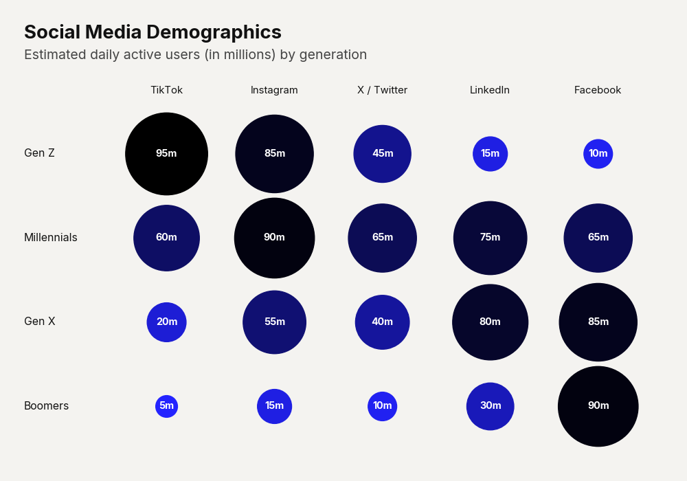

# Use Case: 3D Market Map

A standard two-dimensional scatter plot is often insufficient for holistic financial analysis, as it ignores scale. The '3D Market Map' solves this by mapping a third critical variable—such as market capitalization or total revenue—to the size of the scatter bubble. By dramatically increasing the dot size scalar, the chart visualizes the sheer gravity of different entities within the landscape. It vividly demonstrates that not all high-growth companies carry the same market weight.

```python
import pandas as pd
import clean_charts as cc

df = pd.DataFrame({"Company": ["A", "B", "C"], "Revenue": [10, 50, 100], "Growth": [0.5, 0.2, 0.1], "MarketCap": [100, 500, 1000]})

cc.plot_bubble_scatter_chart(
    data=df,
    title="Market Landscape",
    subtitle="Size = Market Cap",
    )
```


