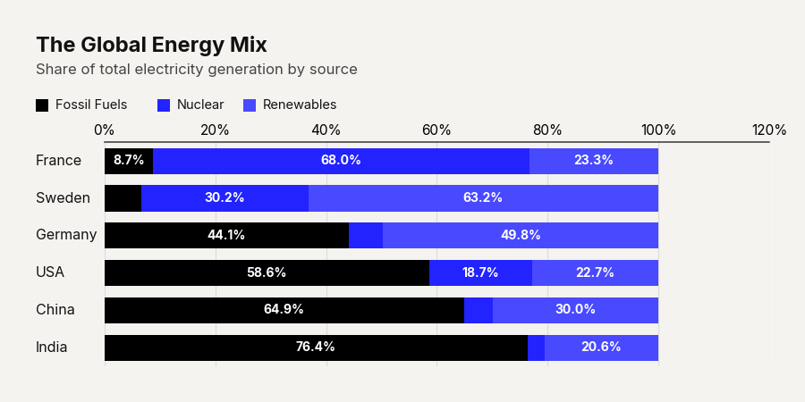

# Use Case: 100% Market Consolidation

Absolute values often mask the true story of market dynamics. When analyzing market share, the absolute size of the pie is less important than how it is divided. By forcing the stacked bar into a 100% normalized mode, every bar becomes identical in length. This strict uniformity isolates the internal shifts between competitors, making the gradual erosion of an incumbent by a challenger glaringly obvious. It is a ruthless, highly effective tool for competitive landscape analysis.

```python
import pandas as pd
import clean_charts as cc

df = pd.DataFrame({"Year": [2020, 2021, 2022], "Incumbent": [80, 60, 40], "Challenger": [20, 40, 60]})

cc.plot_stacked_bar_chart(
    data=df,
    title="Market Share Shift",
    subtitle="Challenger eating incumbent share",
    show_percentages=True,
    bar_labels="none"
)
```


