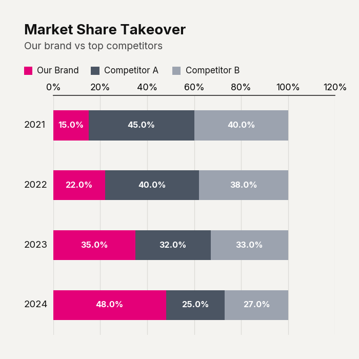

# Use Case: Revenue Layer Cake

When decomposing revenue or demonstrating complex hierarchies, the 'Layer Cake' variation offers unparalleled clarity. By utilizing a vertical aspect ratio and retaining absolute values, the viewer can simultaneously grasp the total aggregate growth and the underlying structural composition. Applying a monochromatic gradient across the tiers ensures that the visual hierarchy matches the data hierarchy, presenting a cohesive, sophisticated breakdown that avoids the jarring clash of multi-colored segments.

```python
import pandas as pd
import clean_charts as cc

df = pd.DataFrame({"Year": [2020, 2021, 2022], "Tier 1": [10, 15, 20], "Tier 2": [20, 25, 30], "Tier 3": [30, 35, 40]})

cc.plot_stacked_bar_chart(
    data=df,
    title="Revenue by Tier",
    subtitle="Absolute values in millions",
    show_percentages=False,
    bar_labels="both",
    aspect_ratio="vertical",
    end_)
```


