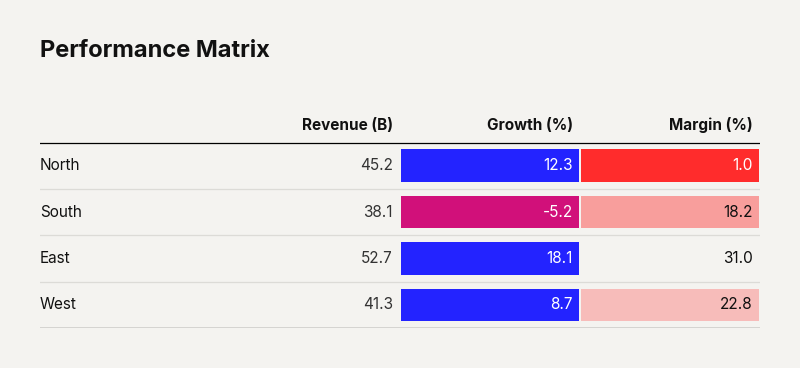

# Use Case: Conditional Heatmap

Dense financial tables are often impenetrable walls of numbers. The 'Conditional Heatmap' approach brings the analytical power of a chart directly into the tabular format. By applying subtle, threshold-based background shading to the cells, it creates an immediate visual hierarchy. The eye is instantly drawn to anomalies, under-performers, and outliers without having to read a single digit. It marries the precision of a data grid with the pre-attentive processing benefits of a heatmap.

```python
import clean_charts as cc
import pandas as pd

df = pd.DataFrame({"A": [1, 10], "B": [5, 2]})

cc.plot_table(
    data=df,
    title="Risk Matrix",
    conditional_formatting=True
)
```


