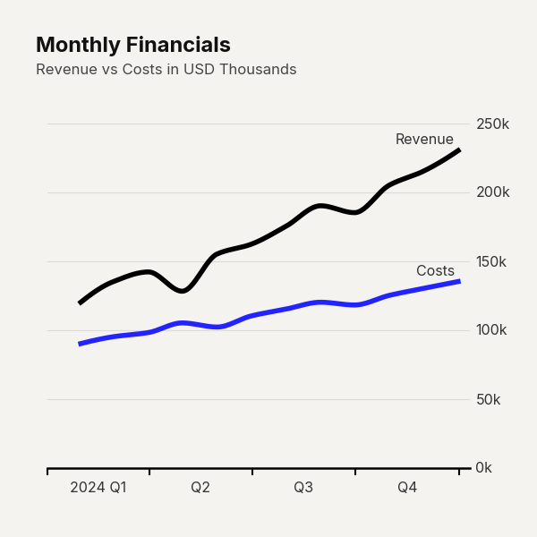

# `plot_time_series()`

**Overview**
Renders a multi-series line chart with smooth spline interpolation and inline series labels. This chart is optimized for visualizing continuous data over time, making it ideal for tracking financial metrics, user growth, or performance trends.



## Basic Usage

```python
import pandas as pd
import clean_charts as cc

df_ts = pd.DataFrame({
    "date": pd.date_range(start="2024-01-01", periods=12, freq="ME"),
    "Revenue": [120, 135, 142, 128, 155, 162, 175, 190, 185, 205, 215, 230],
    "Costs": [90, 95, 98, 105, 102, 110, 115, 120, 118, 125, 130, 135]
})

cc.plot_time_series(
    data=df_ts,
    title="Quarterly Financials",
    subtitle="Revenue vs Costs in USD Thousands",
    label_frequency="quarter",
    line_labels="name",
    value_suffix="k",
    vlines={"date": "2024-06-30", "color": "#000000", "label": "Product Launch"}
)
```

## Data Requirements

The input `data` (a `pandas.DataFrame`) must adhere to the following constraints:
* **Time Column**: Must contain exactly one column with dates or timestamps. This is auto-detected if named `"date"`, `"time"`, or `"timestamp"`, or if its dtype is datetime.
* **Value Columns**: All remaining numeric columns are treated as independent series to be plotted.
* **Frequency**: Data should ideally have a regular interval, though the spline interpolation can handle irregular spacing.

## API Reference

```python
clean_charts.plot_time_series(
    data=None, output_path=None, width=600, height=600, aspect_ratio=None,
    title=None, subtitle=None, bg_color="#f4f3f0", color="#000000", end_color="#2323FF",
    label_frequency="year", markers=None, line_labels="name", value_suffix="", smooth=True,
    scale_text=False, vlines=None, highlight_ranges=None, callouts=None
)
```

| Parameter | Type | Default | Description |
|-----------|------|---------|-------------|
| `data` | `pd.DataFrame` | Built-in | DataFrame containing a date column and one or more numeric series. |
| `aspect_ratio` | `str \| None` | `None` | Options: `"square"`, `"landscape"`, `"vertical"`, `"1:1"`, `"2:1"`, `"1:2"`. |
| `smooth` | `bool` | `True` | Uses PCHIP spline curves instead of straight line segments. |
| `markers` | `bool \| str` | `None` | Renders data-point markers (e.g., `"o"`, `"s"`, `True`). |
| `line_labels` | `str` | `"name"` | Inline text labels: `"name"`, `"value"`, `"both"`, or `"none"`. |
| `vlines` | `list \| dict` | `None` | Adds vertical reference lines with optional labels. |
| `highlight_ranges` | `list \| dict` | `None` | Shaded background regions between two dates. |
| `callouts` | `list \| dict` | `None` | Text callout boxes pointing to specific (date, value) coordinates. |

*(See the generic chart parameters like `title`, `bg_color`, and `output_path` in the [Configuration Guide](#)).*

## Design Best Practices

* **Limit Series Count**: Avoid plotting more than 4-5 series on a single chart to prevent "spaghetti" visuals. Consider small multiples (Geofacet) if you have many series.
* **Label Placement**: Rely on inline `line_labels` at the end of the curves rather than separate legends, as it drastically reduces cognitive load for the reader.
