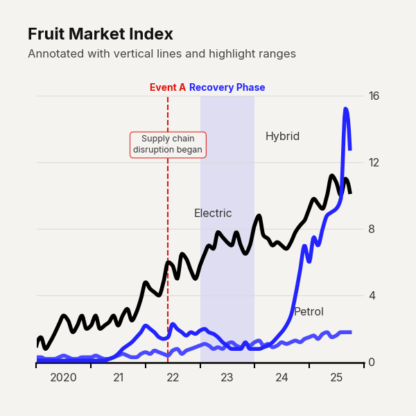

# Use Case: Annotated Milestones

A standard line chart simply shows what happened. By deliberately incorporating `vlines` and `callouts`, you transform the chart into a narrative that explains *why* it happened. This 'Annotated Milestone' approach is a staple of financial journalism. By explicitly pinning paragraphs of text to specific dates or peaks, you eliminate the cognitive burden on the reader. They no longer have to cross-reference the chart with an external paragraph; the visual and the insight are seamlessly integrated.

```python
import pandas as pd
import clean_charts as cc

df = cc.get_default_data()

cc.plot_time_series(
    data=df[["date", "Users"]],
    title="User Growth Over Time",
    subtitle="Key product milestones",
    scale_text=True,
    line_labels="both",
    vlines=[
        {
            "date": "2022-06-15", 
            "label": "Version 2.0", 
            "paragraph": "Major UI overhaul and new features released"
        }
    ],
    callouts=[
        {"date": "2023-01-01", "value": 1M, "text": "1M Users Reached"}
    ]
)
```


