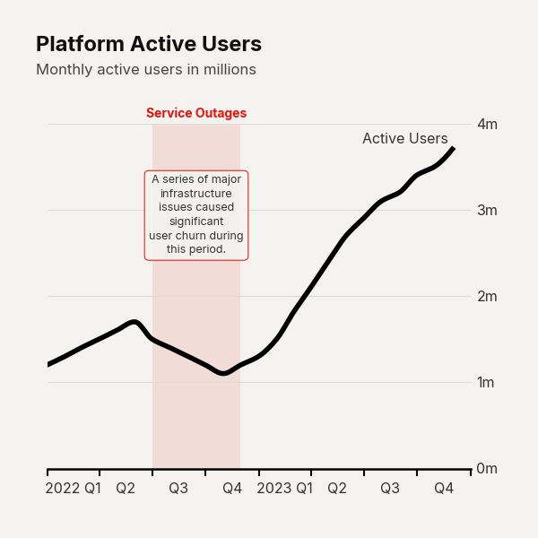

# Use Case: Recession Highlighter

When presenting macroeconomic data, distinguishing between structural shifts and temporary market shocks is critical. The 'Recession Highlighter' configuration strips away the visual noise of granular data points by disabling markers and spline smoothing. Instead, it leverages heavy-alpha `highlight_ranges` to draw the reader's eye directly to historical macro events. This editorial technique grounds abstract time-series data in reality, allowing executive audiences to immediately contextualize performance dips without hunting for dates on the x-axis.

```python
import pandas as pd
import clean_charts as cc

df = pd.DataFrame({'date': pd.date_range('2020-01-01', periods=5, freq='ME'), 'Enterprise': [100, 110, 90, 80, 150]})

cc.plot_time_series(
    data=df[["date", "Enterprise"]],
    title="Market Activity",
    subtitle="Impact of the 2020 and 2022 slowdowns",
    smooth=False,
    markers=None,
    highlight_ranges=[
        {"start": "2020-02-01", "end": "2020-05-01", "color": "#dcdbd7", "alpha": 0.8},
        {"start": "2022-01-01", "end": "2022-09-01", "color": "#dcdbd7", "alpha": 0.8}
    ]
)
```


